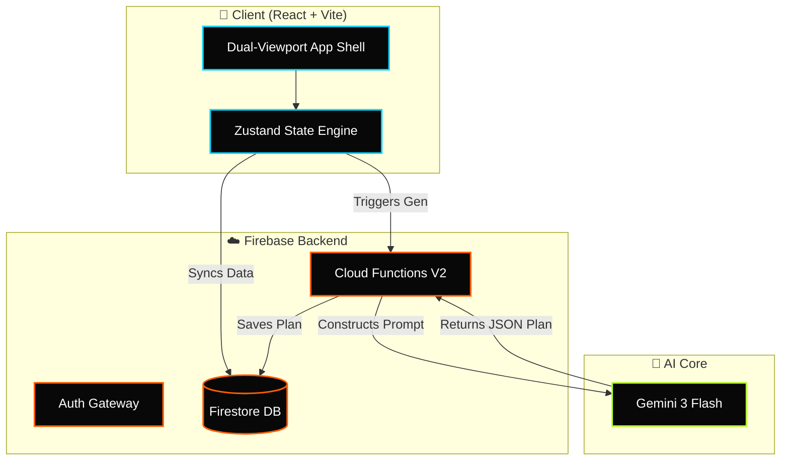

<div align="center">
  <!-- 🔥 Animated Typing Headline 🔥 -->
  <a href="https://github.com/PriyanshuG27/Fitdesi">
    
  </a>

  <!-- Animated Neubrutalism App Mockup Banner -->
  

  <br /><br />

  <!-- Animated Glowing Gemini Badge -->
  
  
  <h3>⚡ Premium Dark Athletic Gym Tracker & Recovery Platform ⚡</h3>
  
  <p>
    FitDesi is a dark athletic fitness tracking web app designed to solve the core failure modes of Indian gym culture: inconsistent attendance, lack of tracking, and difficult comeback phases after breaks.
  </p>

  <!-- 🛡️ Cool Tech Badges -->
  <p>
    
    
    
    
    
    
  </p>

  <br />

  <!-- Real-time Status Bento Grid -->
  <table align="center" style="border-collapse: collapse; border: 2px solid #333; background: #080808; font-family: 'Courier New', Courier, monospace; width: 100%; border-radius: 8px; overflow: hidden; box-shadow: 0px 4px 20px rgba(0,0,0,0.8);">
    <tr style="border-bottom: 1px solid #333;">
      <td style="padding: 15px; border-right: 1px solid #333;"><strong>⚡ SYSTEM STATUS</strong></td>
      <td style="padding: 15px; color: #B5FF2D; border-right: 1px solid #333; text-shadow: 0 0 5px #B5FF2D;">🟢 PRODUCTION ACTIVE</td>
      <td style="padding: 15px; border-right: 1px solid #333;"><strong>🤖 AI ENGINE</strong></td>
      <td style="padding: 15px; color: #00D4FF; text-shadow: 0 0 5px #00D4FF;">⚡ GEMINI 3 FLASH</td>
    </tr>
    <tr>
      <td style="padding: 15px; border-right: 1px solid #333;"><strong>💾 DATABASE</strong></td>
      <td style="padding: 15px; color: #FF5C00; border-right: 1px solid #333; text-shadow: 0 0 5px #FF5C00;">🔥 FIRESTORE</td>
      <td style="padding: 15px; border-right: 1px solid #333;"><strong>🔒 AUTH GATEWAY</strong></td>
      <td style="padding: 15px; color: #F0F0F0; text-shadow: 0 0 5px #FFF;">🛡️ FIREBASE SECURE</td>
    </tr>
  </table>

</div>

<br/>

<br/>

## 

FitDesi uses a custom **Neubrutalism + Dark OLED** style designed to look premium, energetic, and highly tactile. Interactive elements look *liftable*, matching the physical gym environment.

<details>
<summary><b>🎨 View Color Token Registry (CSS Variables)</b></summary>

```css
:root {
  /* Backgrounds */
  --bg-base:       #080808;   /* True OLED black */
  --bg-surface:    #111111;   /* Cards, panels */
  --bg-elevated:   #1A1A1A;   /* Modals, dropdowns */

  /* Brand Accents */
  --primary:       #FF5C00;   /* Burnt orange — energy & drive */
  --secondary:     #00D4FF;   /* Electric cyan — stats & tracking */
  --accent-xp:     #B5FF2D;   /* Acid lime — level-up, PRs, milestones */
}
```
</details>

<br/>

<br/>

## 

<table style="width: 100%; border-collapse: separate; border-spacing: 10px;">
  <tr>
    <td style="background: #111; padding: 20px; border: 1px solid #FF5C00; border-radius: 12px; width: 50%;">
      <h3 style="margin-top:0; color: #FF5C00;">📱 Dual-Viewport Architecture</h3>
      <p style="color: #bbb; font-size: 14px;">Mounts entirely different component trees based on screen width. Mobile gets a thumb-reach bottom nav; Desktop gets a dense multi-column Bento grid.</p>
    </td>
    <td style="background: #111; padding: 20px; border: 1px solid #B5FF2D; border-radius: 12px; width: 50%;">
      <h3 style="margin-top:0; color: #B5FF2D;">🧠 Gemini 3 Flash Auto-Planner</h3>
      <p style="color: #bbb; font-size: 14px;">A serverless Firebase Cloud Function triggers Gemini 3 to construct a dynamic 6-day routine based on your medical limits and available gym equipment.</p>
    </td>
  </tr>
  <tr>
    <td style="background: #111; padding: 20px; border: 1px solid #00D4FF; border-radius: 12px; width: 50%;">
      <h3 style="margin-top:0; color: #00D4FF;">⚡ Tactile PR Engine</h3>
      <p style="color: #bbb; font-size: 14px;">Built for speed in the gym. Giant tap targets, auto-rest timers, and instant canvas particle explosions when you shatter a Personal Record.</p>
    </td>
    <td style="background: #111; padding: 20px; border: 1px solid #FF5F56; border-radius: 12px; width: 50%;">
      <h3 style="margin-top:0; color: #FF5F56;">🔥 Phoenix Protocol</h3>
      <p style="color: #bbb; font-size: 14px;">Coming back after a long break? The Phoenix algorithm auto-scales your old weights down to 40% and ramps them up safely over 8 weeks to prevent injury.</p>
    </td>
  </tr>
</table>

<br/>

<br/>

## 

This flowchart maps the relationships between the client, state stores, and Firebase services:



<br/>

<br/>

## 

| Tier | Level Range | Required XP | Description / Perks |
| :--- | :--- | :--- | :--- |
| **Rookie** 🟢 | 1 – 5 | 0 – 999 XP | Entry-level rank, basic onboarding badges unlocked |
| **Challenger** 🔵 | 6 – 15 | 1,000 – 4,999 XP | Unlocks Custom Challenge builder and streak-at-risk warning notifications |
| **Athlete** 🟡 | 16 – 30 | 5,000 – 14,999 XP | Unlocks detailed progress range filters (90-day & 180-day charts) |
| **Elite** 🔴 | 31+ | 15,000+ XP | Unlocks global leaderboards and Streak Shield power-ups |

<br/>

<br/>

<div align="center">
  <p style="color: #666; font-family: 'DM Mono', monospace; font-size: 12px; letter-spacing: 2px;">
    BUILT FOR THE COMEBACK. BUILT FOR FITDESI.
  </p>
</div>
