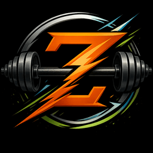
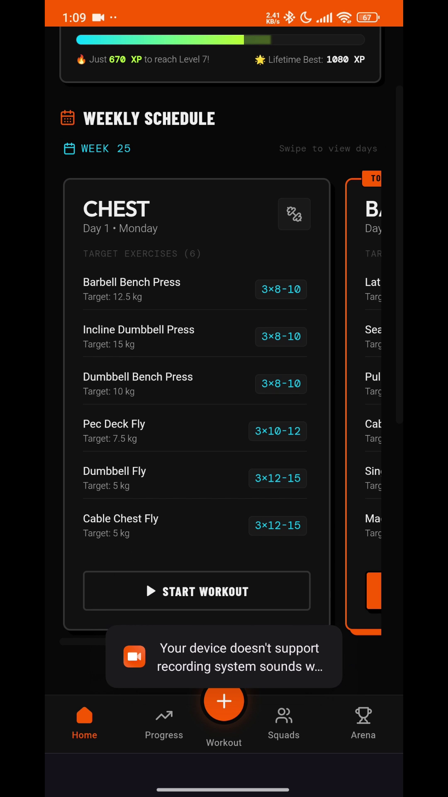
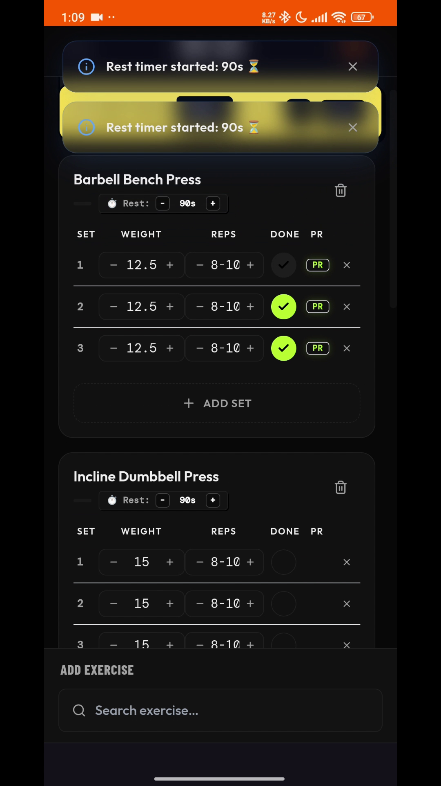
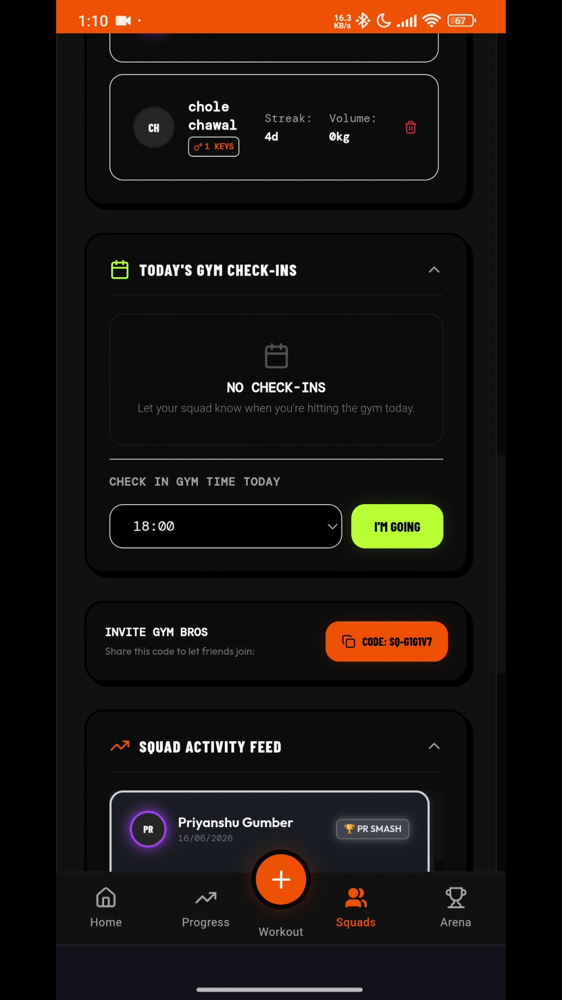
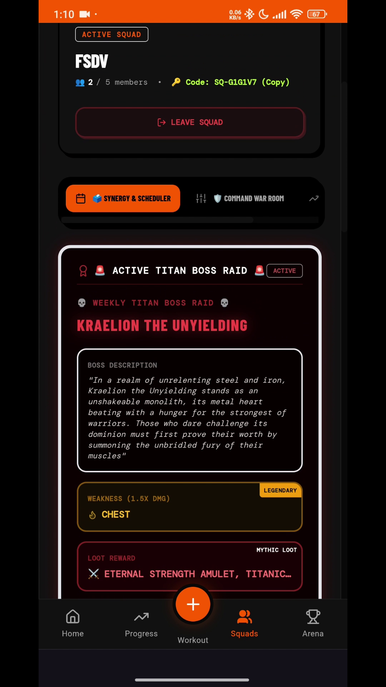
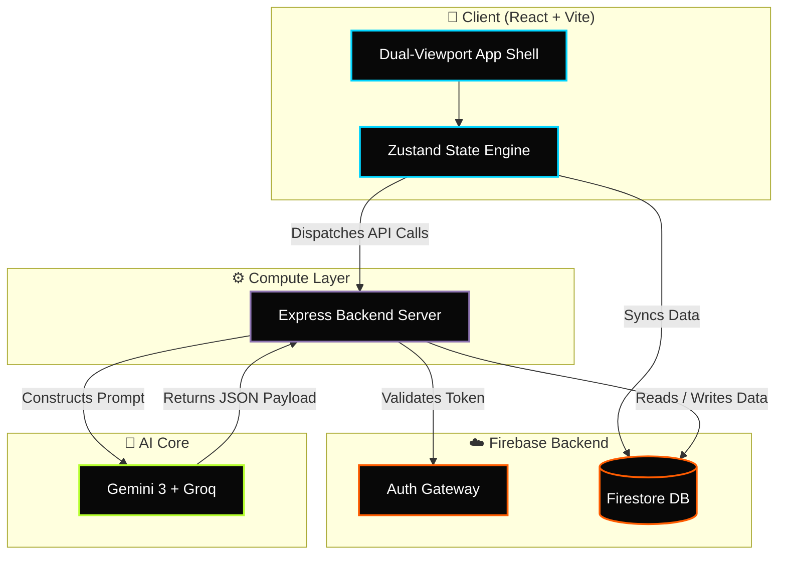

<div align="center">
  <!-- Official Zenkai Logo -->
  

  <br /><br />

  <!-- 🔥 Animated Typing Headline 🔥 -->
  <a href="https://github.com/PriyanshuG27/Zenkai">
    
  </a>

  <!-- Animated Neubrutalism App Mockup Banner -->
  

  <br /><br />

  <!-- Animated Glowing Gemini & Groq Badge -->
  <div style="display: flex; justify-content: center; align-items: center; gap: 15px;">
    
    
  </div>
  
  <h3>⚡ Premium Dark Athletic Gym Tracker & Recovery Platform ⚡</h3>
  
  <p>
    Zenkai is a dark athletic fitness tracking web app designed to solve the core failure modes of Indian gym culture: inconsistent attendance, lack of tracking, and difficult comeback phases after breaks.
  </p>

  <!-- 🛡️ Cool Tech Badges -->
  <p>
    
    
    
    
    
    
    
  </p>

  <br />

  <!-- Real-time Status Bento Grid -->
  <table align="center" style="border-collapse: collapse; border: 2px solid #333; background: #080808; font-family: 'Courier New', Courier, monospace; width: 100%; border-radius: 8px; overflow: hidden; box-shadow: 0px 4px 20px rgba(0,0,0,0.8);">
    <tr style="border-bottom: 1px solid #333;">
      <td style="padding: 15px; border-right: 1px solid #333;"><strong>⚡ SYSTEM STATUS</strong></td>
      <td style="padding: 15px; color: #B5FF2D; border-right: 1px solid #333; text-shadow: 0 0 5px #B5FF2D;">🟢 PRODUCTION ACTIVE</td>
      <td style="padding: 15px; border-right: 1px solid #333;"><strong>🤖 AI ENGINES</strong></td>
      <td style="padding: 15px; color: #00D4FF; text-shadow: 0 0 5px #00D4FF;">⚡ GEMINI + GROQ</td>
    </tr>
    <tr>
      <td style="padding: 15px; border-right: 1px solid #333;"><strong>💾 DATABASE</strong></td>
      <td style="padding: 15px; color: #FF5C00; border-right: 1px solid #333; text-shadow: 0 0 5px #FF5C00;">🔥 FIRESTORE</td>
      <td style="padding: 15px; border-right: 1px solid #333;"><strong>🔒 AUTH GATEWAY</strong></td>
      <td style="padding: 15px; color: #F0F0F0; text-shadow: 0 0 5px #FFF;">🛡️ FIREBASE SECURE</td>
    </tr>
  </table>

</div>

<br/>

<br/>

## 

<p align="center">
  
  
</p>
<p align="center">
  
  
</p>

<br/>

<br/>

## 

Zenkai uses a custom **Neubrutalism + Dark OLED** style designed to look premium, energetic, and highly tactile. Interactive elements look *liftable*, matching the physical gym environment.

<details>
<summary><b>🎨 View Color Token Registry (CSS Variables)</b></summary>

```css
:root {
  /* Backgrounds */
  --bg-base:       #080808;   /* True OLED black */
  --bg-surface:    #111111;   /* Cards, panels */
  --bg-elevated:   #1A1A1A;   /* Modals, dropdowns */

  /* Brand Accents */
  --primary:       #FF5C00;   /* Burnt orange — energy & drive */
  --secondary:     #00D4FF;   /* Electric cyan — stats & tracking */
  --accent-xp:     #B5FF2D;   /* Acid lime — level-up, PRs, milestones */
}
```
</details>

<br/>

<br/>

## 

<table style="width: 100%; border-collapse: separate; border-spacing: 10px;">
  <tr>
    <td style="background: #111; padding: 20px; border: 1px solid #FF5C00; border-radius: 12px; width: 50%;">
      <h3 style="margin-top:0; color: #FF5C00;">📱 Dual-Viewport Architecture</h3>
      <p style="color: #bbb; font-size: 14px;">Mounts entirely different component trees based on screen width. Mobile gets a thumb-reach bottom nav; Desktop gets a dense multi-column command center.</p>
    </td>
    <td style="background: #111; padding: 20px; border: 1px solid #B5FF2D; border-radius: 12px; width: 50%;">
      <h3 style="margin-top:0; color: #B5FF2D;">🧠 Gemini + Groq AI Planner</h3>
      <p style="color: #bbb; font-size: 14px;">A Node.js Express server triggers Gemini &amp; Groq APIs to construct a dynamic 6-day routine based on your medical limits, goals, and available gym equipment.</p>
    </td>
  </tr>
  <tr>
    <td style="background: #111; padding: 20px; border: 1px solid #00D4FF; border-radius: 12px; width: 50%;">
      <h3 style="margin-top:0; color: #00D4FF;">⚡ Tactile PR Engine</h3>
      <p style="color: #bbb; font-size: 14px;">Built for speed in the gym. Giant tap targets, auto-rest timers, and instant canvas particle explosions when you shatter a Personal Record.</p>
    </td>
    <td style="background: #111; padding: 20px; border: 1px solid #FF5F56; border-radius: 12px; width: 50%;">
      <h3 style="margin-top:0; color: #FF5F56;">🔥 Phoenix Protocol</h3>
      <p style="color: #bbb; font-size: 14px;">Coming back after a long break? The Phoenix algorithm auto-scales your old weights down to 40% and ramps them up safely over 8 weeks to prevent injury.</p>
    </td>
  </tr>
  <tr>
    <td style="background: #111; padding: 20px; border: 1px solid #B5FF2D; border-radius: 12px; width: 50%;">
      <h3 style="margin-top:0; color: #B5FF2D;">🎨 Aura &amp; Beast Mode Forecaster</h3>
      <p style="color: #bbb; font-size: 14px;">Tracks daily gym Aura, applying decay for inactivity and bonuses for high intensity (RPE/MMC). Includes a real-time PR breakthrough probability simulator and Radar charts.</p>
    </td>
    <td style="background: #111; padding: 20px; border: 1px solid #FF8A00; border-radius: 12px; width: 50%;">
      <h3 style="margin-top:0; color: #FF8A00;">📰 Sunday AI Magazine &amp; Poster Studio</h3>
      <p style="color: #bbb; font-size: 14px;">Personalized weekly newspaper summaries featuring verbal cues overlays, paired with a Poster Studio using Konva for dragging achievements and badges into shareable cards.</p>
    </td>
  </tr>
  <tr>
    <td style="background: #111; padding: 20px; border: 1px solid #00D4FF; border-radius: 12px; width: 50%;">
      <h3 style="margin-top:0; color: #00D4FF;">⚔️ Shared Squads &amp; Leaderboards</h3>
      <p style="color: #bbb; font-size: 14px;">Create or join password-protected squads. Share gym check-ins and workout completions to a live feed, react to teammates' lifts, and compete on a weekly XP leaderboard to stay accountable.</p>
    </td>
    <td style="background: #111; padding: 20px; border: 1px solid #FF5C00; border-radius: 12px; width: 50%;">
      <h3 style="margin-top:0; color: #FF5C00;">📸 verifyGymImage (AI Gym Check-in)</h3>
      <p style="color: #bbb; font-size: 14px;">Prevent fake workout streaks. Upload a live photo of your gym environment; Zenkai's backend AI vision validates the equipment and location before awarding check-in XP.</p>
    </td>
  </tr>
</table>

<br/>

<br/>

## 

This flowchart maps the relationships between the client, state stores, Express backend server, and third-party APIs:



<br/>

<br/>

## 

Zenkai is engineered to operate seamlessly in basement gyms with zero signal. The offline sync architecture relies on Firestore's **multi-tab IndexedDB persistent cache** combined with a dual-vector sync engine.

### 🔌 How Dual-Vector Sync Works in Code:
1. **Vector 1: Real-time Cloud Target Listener (`onSnapshot`)**
   - Active listener in [useSyncEngine.js](file:///d:/Fitdesi/src/hooks/useSyncEngine.js#L45-L66) monitors the `planned_targets` subcollection in Firestore.
   - When the server generates a new AI workout plan, the client automatically receives the new plan and updates the Zustand store instantly in the background without manual polling.

2. **Vector 2: Latency-Compensated Offline Writes**
   - Enabled via `persistentLocalCache({ tabManager: persistentMultipleTabManager() })` inside [firebase.js](file:///d:/Fitdesi/src/lib/firebase.js#L37-L41).
   - When a user logs a workout set offline, Firestore intercepts the write, instantly commits it to the local IndexedDB cache, and registers a pending sync mutation. The UI updates instantly (latency compensation).
   - Once connection is restored, the client automatically flushes the queue to the cloud. Collision resolution is handled by Firestore's document-versioning system (`last-write-wins` paradigm with transactional validation).

<br/>

<br/>

## 

| Tier | Level Range | Required XP | Description / Perks |
| :--- | :--- | :--- | :--- |
| **Rookie** 🟢 | 1 – 5 | 0 – 999 XP | Entry-level rank, basic onboarding badges unlocked |
| **Challenger** 🔵 | 6 – 15 | 1,000 – 4,999 XP | Unlocks Custom Challenge builder and streak-at-risk warning notifications |
| **Athlete** 🟡 | 16 – 30 | 5,000 – 14,999 XP | Unlocks detailed progress range filters (90-day & 180-day charts) |
| **Elite** 🔴 | 31+ | 15,000+ XP | Unlocks global leaderboards and Streak Shield power-ups |

<br/>

<br/>

## 

<details>
<summary><b>📂 View Complete Directory Map</b></summary>

```
Zenkai/
├── .env.example              # Template for frontend environment variables
├── .gitignore                # Production ignore patterns for keys & node_modules
├── eslint.config.js          # Code linting settings
├── index.html                # App entry document
├── package.json              # Client packages and scripts
├── postcss.config.js         # PostCSS plugins
├── tailwind.config.js        # Neubrutalism theme & typography customisations
├── vite.config.js            # Vite configurations and port setup
│
├── docs/                     # Full system documentation
│   ├── APP_FLOW.md           # Visual user flows and state diagrams
│   ├── AUDIT_CHECKLIST.md    # Pre-launch security & quality checklist
│   ├── BACKEND_SCHEMA.md     # Firestore collection structures & schemas
│   ├── DEPLOYMENT.md         # Detailed environment deployment procedures
│   ├── ENV_CONFIG.md         # Environment variable documentation
│   ├── ERROR_HANDLING.md     # Client & function error policies
│   ├── IMPLEMENTATION_PLAN.md# Technical breakdown of features
│   ├── PERFORMANCE.md        # Loading, interaction, and rendering targets
│   ├── PRD.md                # Product Requirements Document
│   ├── SECURITY.md           # Firestore rules and client token rotation
│   ├── TESTING.md            # Comprehensive client/backend testing manual
│   ├── TRD.md                # Technical Requirements Document
│   └── UI_UX_BRIEF.md        # CSS color tokens, layouts, & animations brief
│
├── backend/                  # Companion Node.js Express server (Backend)
│   ├── server.js             # Express application entrypoint
│   ├── package.json          # Backend dependencies (express, firebase-admin, etc.)
│   ├── lib/                  # Admin helpers, DB connect, and API clients (Gemini/Groq)
│   ├── routes/               # Modular API endpoint handlers (plans, magazines, challenges)
│   ├── middleware/           # Express middleware (Auth validation, rate-limiting)
│   └── data/                 # System catalogs, prompt configurations, & datasets
│
└── src/                      # Client Application (Frontend)
    ├── App.jsx               # Layout toggle and code-split suspense routing entrypoint
    ├── index.css             # Main stylesheet (Neubrutalism design tokens + fonts)
    ├── main.jsx              # Client mount point and env verification
    │
    ├── assets/               # Image/SVG asset files
    ├── components/           # Dual Viewport UI Components
    │   ├── desktop/          # Command Center: AuraForecaster, SundayMagazine, PosterStudio, etc.
    │   ├── mobile/           # Gym Companion: MobileLogger, MobileProgress, MobileChallenges, etc.
    │   └── shared/           # Universal views: MuscleMap, OnboardingPage, NeubrutalistCalendar, etc.
    │
    ├── data/                 # Curated exercise dataset & static mappings
    ├── hooks/                # Layout-agnostic Custom React Hooks
    │   ├── useAuth.js        # Auth handler and ZK- / FIT- prefix generation
    │   ├── useWorkoutLogger.js# Workout debriefing and Titan Boss damage engine
    │   ├── useWeeklyPlan.js  # Plan generation dispatcher calling Express backend
    │   ├── useWeeklyRecap.js # Weekly summaries and recap telemetry
    │   └── ...
    │
    ├── lib/                  # Library SDK initializers
    │   ├── firebase.js       # Firebase Client SDK initializer
    │   └── firebaseConfig.js # Firebase config variables
    │
    └── stores/               # Zustand Global State Stores
        ├── authStore.js      # Auth & Profile observer states
        ├── useWorkoutStore.js# Active session and logging sets buffer
        ├── usePlanStore.js   # Generated workout schedules and target states
        └── ...
```
</details>

<br/>

<br/>

## 

<details>
<summary><b>🔑 View Local & Production Configuration Keys</b></summary>

### Client Environment Variables (`.env`)
Create a `.env` file in the project root:
```bash
VITE_FIREBASE_API_KEY=your_api_key
VITE_FIREBASE_AUTH_DOMAIN=zenkai-app.firebaseapp.com
VITE_FIREBASE_PROJECT_ID=zenkai-app
VITE_FIREBASE_STORAGE_BUCKET=zenkai-app.appspot.com
VITE_FIREBASE_MESSAGING_SENDER_ID=your_messaging_sender_id
VITE_FIREBASE_APP_ID=your_app_id
VITE_API_BASE_URL=http://localhost:10000
```

### Backend Environment Variables (`backend/.env`)
Create a `.env` file in the `/backend` folder for local development:
```bash
PORT=10000
GEMINI_API_KEY=your_gemini_api_key
GROQ_API_KEY=your_groq_api_key
VITE_FIREBASE_PROJECT_ID=zenkai-app
```
</details>

<br/>

<br/>

## 

Follow these steps to run the Zenkai application locally:

### 1. Installation
Install the project dependencies for the client and backend Express server:
```bash
# Clone the repository
git clone https://github.com/PriyanshuG27/Zenkai.git
cd Zenkai

# Install client packages
npm install

# Install backend packages
cd backend
npm install
cd ..
```

### 2. Set Up Firebase Emulators
The project is configured to work with Firestore and Firebase Auth Emulators:
```bash
# Install Firebase Tools if not already installed globally
npm install -g firebase-tools

# Login to Firebase
firebase login

# Initialize project references
firebase use --add

# Run the emulators
firebase emulators:start
```

### 3. Run the Compute Services
In a new terminal window, start the local backend server:
```bash
cd backend
npm start
```

### 4. Run the Frontend Development Server
In another terminal window, start the local Vite development server:
```bash
npm run dev
```
Open `http://localhost:5173` to view the app in your browser.

</details>

<br/>

<br/>

## 

<details>
<summary><b>📦 View Deployment Steps (Vercel & Render)</b></summary>

### Deploying the Backend (Render)
1. Connect your repository to Render.com and create a new **Web Service**.
2. Set the root directory to `backend`.
3. Set the build command to `npm install` and the start command to `npm start`.
4. Configure environment variables in the dashboard:
   - `PORT`: `10000`
   - `GEMINI_API_KEY`: *(Your Production Gemini Key)*
   - `GROQ_API_KEY`: *(Your Production Groq Key)*
   - `VITE_FIREBASE_PROJECT_ID`: `zenkai-prod`
   - `FIREBASE_PROJECT_ID`: `zenkai-prod`
   - `FIREBASE_CLIENT_EMAIL`: `prod-service-account-email`
   - `FIREBASE_PRIVATE_KEY`: `prod-service-account-private-key-string`

### Deploying the Frontend (Vercel)
Install Vercel CLI and trigger a production deploy:
```bash
npm install -g vercel
vercel --prod
```
Ensure you have configured all client environment variables in the Vercel project dashboard under **Settings > Environment Variables**, including mapping `VITE_API_BASE_URL` to your Render Web Service URL.
</details>

<br/>

<br/>

## 

For detailed reviews of technical requirements, audits, and performance targets:
* 📄 [Product Requirements Document (PRD)](./docs/PRD.md)
* 📄 [Technical Requirements Document (TRD)](./docs/TRD.md)
* 📄 [UI/UX Design Specification Brief](./docs/UI_UX_BRIEF.md)
* 📄 [Environment Configuration Guide](./docs/ENV_CONFIG.md)
* 📄 [Firestore Security & Rules Spec](./docs/SECURITY.md)
* 📄 [Performance & Load Optimization Plans](./docs/PERFORMANCE.md)
* 📄 [System Testing & Audit Framework](./docs/TESTING.md)

<br/>

<br/>

<div align="center">
  <p style="color: #666; font-family: 'DM Mono', monospace; font-size: 12px; letter-spacing: 2px;">
    BUILT FOR THE COMEBACK. BUILT FOR ZENKAI.
  </p>
</div>
