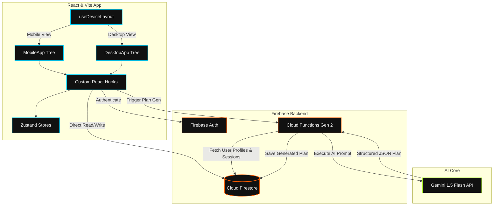
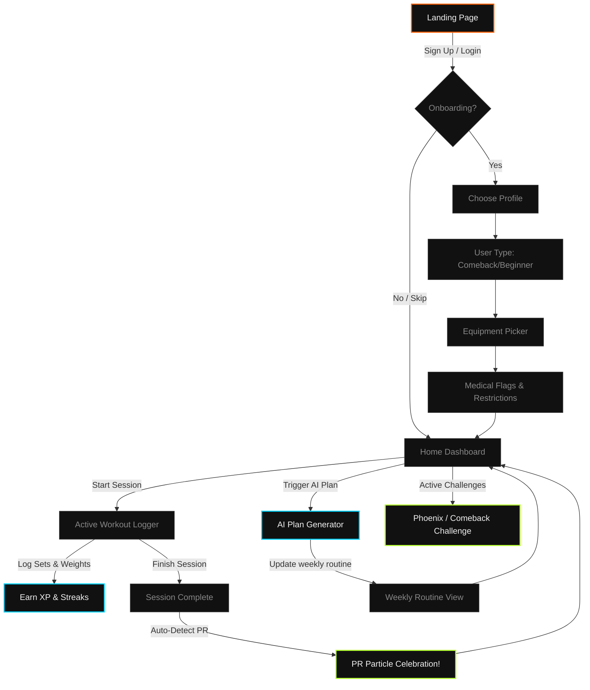

<div align="center">
  

  <br />

  
  
  <p>
    <strong>A premium, dark athletic fitness tracking web app tailored for Indian gym users (ages 18–25).</strong>
  </p>
  
  <p>
    FitDesi addresses the unique challenges of Indian gym culture—such as inconsistent attendance, lack of workout tracking, and the difficulty of rebuilding consistency after breaks. By integrating equipment-aware, medically gated, comeback-first plans with gamified XP and challenge mechanics, FitDesi helps users build lasting habits.
  </p>
</div>

---

## 🚀 Key Features

* **📱 Mobile-First Responsive Layout**: Dual-viewport layout optimized for a native-feeling mobile app experience (true OLED dark base + Neubrutalism UI with $\ge$ 44x44px touch targets) and a dense, feature-rich desktop dashboard.
* **⚡ Rapid Tap-Based Logging**: Log a complete workout in under 10 taps with large, easy-to-use weight and rep counters designed for gym use.
* **🧠 Gemini AI Weekly Plan Generation**: Generates customized weekly workout plans powered by `gemini-1.5-flash` via Firebase Cloud Functions based on training history, equipment availability, medical restrictions, and fatigue tags.
* **🔥 Phoenix & Streak Challenges**: First-class "Comeback Challenge" that starts users at a lower workload (40-70%) with $2\times$ XP rewards to ease them back into training without fatigue or injury.
* **🎮 Gamified XP & Streak Engine**: Earn XP from completed sets, PRs, and challenges. Unlock level tiers (Rookie ➔ Challenger ➔ Athlete ➔ Elite) and track workout streaks with streak-at-risk warning systems.
* **📊 Visual Progress Dashboards**: Line charts showing strength progression and bar charts tracking weekly training volume using Recharts.
* **🎉 Fluid UI Celebrations**: Staged level-up reveals, PR particle bursts, and set-completion checkmark animations powered by Framer Motion.

---

## 🛠 Technology Stack

| Layer | Technology | Rationale / Details |
|---|---|---|
| **Frontend Framework** | **React (Vite)** | High-performance dev server, fast Hot Module Replacement (HMR). |
| **Styling** | **Tailwind CSS v3** | Responsive utility classes, dark-mode styling, zero runtime overhead. |
| **State Management** | **Zustand** | Scoped, lightweight, boilerplate-free state stores. |
| **Animations** | **Framer Motion** | Spring physics, fluid page transitions, and interactive celebration moments. |
| **Charts** | **Recharts** | Lightweight, clean SVG-based data visualizations. |
| **Authentication** | **Firebase Auth** | Google OAuth and Email/Password flows with persistent user sessions. |
| **Database** | **Cloud Firestore** | Document model mapping for workouts, user profiles, and challenges. |
| **Backend & AI** | **Firebase Cloud Functions (Gen 2)** | Secure, isolated Node.js 20 serverless functions for calling Gemini. |
| **AI Model** | **Gemini 1.5 Flash** | Cost-effective, high-speed structured JSON output generation. |
| **Hosting** | **Vercel** | Automated CI/CD deployments connected to GitHub. |

---

## 📐 System Architecture

This flowchart outlines the data flows and integration points between the React/Vite frontend, Zustand state stores, Firebase Authentication, Cloud Firestore, and the backend Firebase Cloud Functions that communicate with Gemini Flash.



---

## 🧭 Application Flow & User Journey

Here is the step-by-step navigation path of a user from onboarding configuration to tracking exercises, achieving level-up tiers, and generating routines:



---

## 📂 Project Architecture

```
Fitdesi/
├── .env.example              # Template for frontend environment variables
├── .gitignore                # Production ignore patterns for keys & node_modules
├── eslint.config.js          # Code linting settings
├── index.html                # App entry document
├── package.json              # Client packages and scripts
├── postcss.config.js         # PostCSS plugins
├── tailwind.config.js        # Neubrutalism theme & typography customisations
├── vite.config.js            # Vite configurations and port setup
│
├── docs/                     # Full system documentation
│   ├── APP_FLOW.md           # Visual user flows and state diagrams
│   ├── AUDIT_CHECKLIST.md    # Pre-launch security & quality checklist
│   ├── BACKEND_SCHEMA.md     # Firestore collection structures & schemas
│   ├── DEPLOYMENT.md         # Detailed environment deployment procedures
│   ├── ENV_CONFIG.md         # Environment variable documentation
│   ├── ERROR_HANDLING.md     # Client & function error policies
│   ├── IMPLEMENTATION_PLAN.md# Technical breakdown of features
│   ├── PERFORMANCE.md        # Loading, interaction, and rendering targets
│   ├── PRD.md                # Product Requirements Document
│   ├── SECURITY.md           # Firestore rules and client token rotation
│   ├── TESTING.md            # Comprehensive client/backend testing manual
│   ├── TRD.md                # Technical Requirements Document
│   └── UI_UX_BRIEF.md        # CSS color tokens, layouts, & animations brief
│
├── functions/                # Firebase Cloud Functions (Backend)
│   ├── .env.example          # Template for backend Cloud Functions keys
│   ├── index.js              # Entrypoint for Cloud Functions export
│   ├── package.json          # Node.js 20 functions dependencies
│   └── src/
│       └── generatePlan.js   # Gemini 1.5 Flash workout prompt generator
│
└── src/                      # Client Application (Frontend)
    ├── App.jsx               # Layout toggle entrypoint
    ├── index.css             # Main stylesheet (Neubrutalism styles + Google Fonts)
    ├── main.jsx              # App mount point & env validation execution
    │
    ├── assets/               # Image/SVG asset files
    ├── components/           # Dual Viewport UI Components
    │   ├── desktop/          # Sidebar navigation, Bento dashboard, Dense graphs
    │   ├── mobile/           # Bottom navigation, fullscreen logger, Swipe panels
    │   └── shared/           # Protected routing and general layout wrappers
    │
    ├── data/                 # Curated exercise dataset & static mappings
    ├── hooks/                # Layout-agnostic Custom React Hooks
    │   ├── useAuth.js        # Auth state observer
    │   ├── useWorkout.js     # Active session, logging actions
    │   ├── useXPEngine.js    # Level tier and streak calculation
    │   ├── usePlan.js        # Custom plan generation handler
    │   └── ...
    │
    ├── lib/                  # Library SDK initializers
    │   ├── firebase.js       # Firebase Client SDK initializer
    │   └── firebaseConfig.js # Firebase config variables
    │
    └── stores/               # Zustand Global State Stores
        ├── useAuthStore.js
        ├── usePlanStore.js
        ├── useWorkoutStore.js
        └── ...
```

---

## ⚙️ Environment Configuration

### Client Environment Variables (`.env`)
Create a `.env` file in the project root:
```bash
VITE_FIREBASE_API_KEY=your_api_key
VITE_FIREBASE_AUTH_DOMAIN=fitdesi-app.firebaseapp.com
VITE_FIREBASE_PROJECT_ID=fitdesi-app
VITE_FIREBASE_STORAGE_BUCKET=fitdesi-app.appspot.com
VITE_FIREBASE_MESSAGING_SENDER_ID=your_messaging_sender_id
VITE_FIREBASE_APP_ID=your_app_id
```

### Backend Environment Variables (`functions/.env`)
Create a `.env` file in the `/functions` folder for local emulator testing:
```bash
GEMINI_API_KEY=your_gemini_api_key
```

For production, set it using the Firebase CLI config:
```bash
firebase functions:config:set gemini.key="YOUR_GEMINI_API_KEY"
```

---

## 🛠️ Local Development Setup

Follow these steps to run the FitDesi application locally:

### 1. Installation
Install the project dependencies for the client and backend functions:
```bash
# Clone the repository
git clone https://github.com/PriyanshuG27/Fitdesi.git
cd Fitdesi

# Install client packages
npm install

# Install functions packages
cd functions
npm install
cd ..
```

### 2. Set Up Firebase Emulators
The project is configured to work with Firestore and Firebase Auth Emulators:
```bash
# Install Firebase Tools if not already installed globally
npm install -g firebase-tools

# Login to Firebase
firebase login

# Initialize project references
firebase use --add

# Run the emulators
firebase emulators:start
```

### 3. Run the Frontend Development Server
In a new terminal window, start the local Vite development server:
```bash
npm run dev
```
Open `http://localhost:5173` to view the app in your browser.

---

## 🚀 Deployment

### Deploying the Backend (Firebase Functions & Security Rules)
```bash
# Deploy firestore rules, indexes, and cloud functions
firebase deploy
```

### Deploying the Frontend (Vercel)
Install Vercel CLI and trigger a production deploy:
```bash
npm install -g vercel
vercel --prod
```
Ensure you have configured all client environment variables in the Vercel project dashboard under **Settings > Environment Variables**.

---

## 📖 Related Documentation

For deep dives into the technical details and product architecture of the FitDesi platform, check out:
* [Product Requirements Document (PRD)](file:///d:/Fitdesi/docs/PRD.md)
* [Technical Requirements Document (TRD)](file:///d:/Fitdesi/docs/TRD.md)
* [UI/UX Design Brief](file:///d:/Fitdesi/docs/UI_UX_BRIEF.md)
* [Environment Configuration Guide](file:///d:/Fitdesi/docs/ENV_CONFIG.md)
* [System Security & Access Control](file:///d:/Fitdesi/docs/SECURITY.md)
