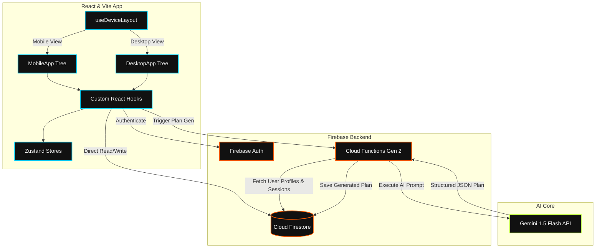
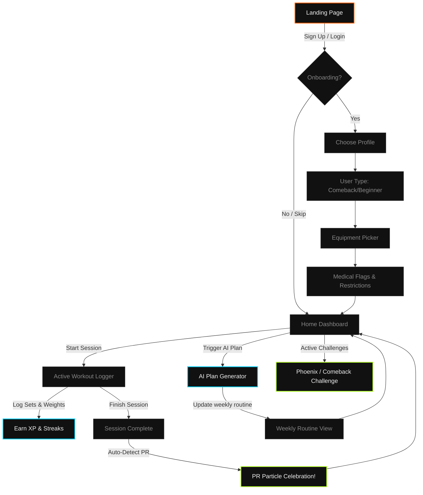

<div align="center">
  <!-- Animated Neubrutalism App Mockup Banner -->
  

  <br />

  <!-- Animated Glowing Gemini Badge -->
  
  
  <h3>⚡ Premium Dark Athletic Gym Tracker &amp; Recovery Platform ⚡</h3>
  
  <p>
    FitDesi is a high-energy, dark-themed fitness tracking platform designed to combat inconsistent training habits and structured comebacks for Indian gym users (ages 18–25).
  </p>

  <!-- Real-time Status Bento Grid -->
  <table align="center" style="border: 2px solid #222; background: #0c0c0c; font-family: 'DM Mono', monospace; text-align: left;">
    <tr style="border-bottom: 1px solid #222;">
      <td style="padding: 10px; border-right: 1px solid #222;"><strong>⚡ System Status</strong></td>
      <td style="padding: 10px; color: #B5FF2D; border-right: 1px solid #222;">🟢 PRODUCTION ACTIVE</td>
      <td style="padding: 10px; border-right: 1px solid #222;"><strong>🤖 AI Engine</strong></td>
      <td style="padding: 10px; color: #00D4FF;">⚡ GEMINI 1.5 FLASH</td>
    </tr>
    <tr>
      <td style="padding: 10px; border-right: 1px solid #222;"><strong>💾 Database</strong></td>
      <td style="padding: 10px; color: #FF5C00; border-right: 1px solid #222;">🔥 CLOUD FIRESTORE</td>
      <td style="padding: 10px; border-right: 1px solid #222;"><strong>🔒 Auth Gateway</strong></td>
      <td style="padding: 10px; color: #F0F0F0;">🛡️ FIREBASE SECURE</td>
    </tr>
  </table>
</div>

---

## 🎨 The Design System (Neubrutalism &amp; OLED)

FitDesi uses a custom **Neubrutalism + Dark OLED** layout built for maximum battery efficiency on AMOLED screens in high-glare gym settings.

```
━━━━━━━━━━━━━━━━━━━━━━━━━━━━━━━━━━━━━━━━━━━━━━━━━━━━━━━━━━━━━━━━━━━━━━━━
🎨 PATTERN:     Mobile Bottom Navigation + Full-Screen Context Logging
                Desktop Left Sidebar + Multi-column Bento Grid
💻 THEME:       True OLED Black base (#080808) + High-contrast Borders
💥 ACCENTS:     Burnt Orange (#FF5C00) · Electric Cyan (#00D4FF) · Acid Lime (#B5FF2D)
⚡ TRANSITIONS: Framer Motion spring physics on actions & celebrations
━━━━━━━━━━━━━━━━━━━━━━━━━━━━━━━━━━━━━━━━━━━━━━━━━━━━━━━━━━━━━━━━━━━━━━━━
```

<details>
<summary><b>🎨 View CSS Variables &amp; Design Token Values</b></summary>

```css
:root {
  /* Backgrounds */
  --bg-base:       #080808;   /* True OLED black */
  --bg-surface:    #111111;   /* Cards, panels */
  --bg-elevated:   #1A1A1A;   /* Modals, dropdowns */
  --bg-input:      #141414;   /* Input fields */

  /* Brand Accents */
  --primary:       #FF5C00;   /* Burnt orange — energy & drive */
  --primary-glow:  rgba(255, 92, 0, 0.25);
  --secondary:     #00D4FF;   /* Electric cyan — stats & tracking */
  --secondary-glow:rgba(0, 212, 255, 0.20);
  --accent-xp:     #B5FF2D;   /* Acid lime — level-up, PRs, milestones */
  --accent-xp-glow:rgba(181, 255, 45, 0.20);

  /* Typography Scale */
  --font-display:  'Barlow Condensed', sans-serif; /* Headings */
  --font-body:     'Outfit', sans-serif;           /* Main UI & reading */
  --font-mono:     'DM Mono', monospace;           /* Numeric stats */
}
```
</details>

---

## ⌨️ Desktop Keyboard Controls (Power-User Panel)

To speed up logging on desktop views, the app binds keyboard hotkeys directly to the Zustand workout logger state:

| Action | Shortcut Key | Description |
| :--- | :--- | :--- |
| **Start Workout** | <kbd>Alt</kbd> + <kbd>S</kbd> | Fires the active session timer and opens the slide-in logger panel. |
| **Add Exercise** | <kbd>Alt</kbd> + <kbd>E</kbd> | Triggers the search input overlay to add a movement. |
| **Add Set** | <kbd>Alt</kbd> + <kbd>A</kbd> | Inserts a new set row to the active exercise block. |
| **Confirm Set** | <kbd>Enter</kbd> | Toggles completion checkmark on the currently focused set row. |
| **Finish Workout** | <kbd>Alt</kbd> + <kbd>F</kbd> | Concludes the session, triggers the summary calculations and XP awards. |
| **Close Panel** | <kbd>Esc</kbd> | Closes modals, dropdowns, and overlays. |

---

## 🚀 Interactive Feature Matrix

Explore how FitDesi's recovery mechanics are structured technically:

<details>
<summary><b>📱 Dual-Viewport Layout Switcher</b></summary>

```
┌───────────────────────────────────────────────┐
│               App Root (Mount)                │
│             Reads useDeviceLayout()           │
└───────────────────────┬───────────────────────┘
                        │
            ┌───────────┴───────────┐
            ▼                       ▼
    [Width < 768px]         [Width >= 768px]
     MobileApp Shell       DesktopApp Shell
    ┌───────────────┐       ┌───────────────┐
    │  Bottom Nav   │       │ Side Sidebar  │
    │ Fullscreen Log│       │ Bento Grid    │
    └───────────────┘       └───────────────┘
```
The client listens to browser resizing on a 100ms debounced hooks handler. It swaps component trees on the fly, sharing the same `BrowserRouter` instance and memory references, so user state is never lost.
</details>

<details>
<summary><b>🧠 Gemini AI Training Optimizer (HTTP Callable)</b></summary>

The AI routine builder acts as a serverless personal trainer that never schedules unsafe exercises:

```javascript
// functions/src/generatePlan.js
1. Receives client trigger: userType, equipmentList, medicalFlags, trainingHistory.
2. Compiles user data into a clean, system-directed prompt.
3. Invokes Gemini-1.5-Flash requesting strict structured JSON.
4. Updates the database at `users/{uid}/weeklyPlans/{weekId}`.
```
*   **Safety Gate**: If `varicocele` or `lower back` is flagged, the prompt bans heavy load vectors like Squats, Deadlifts, and Leg Press.
*   **Fatigue Check**: If the user logged stomach cramps or low energy in the last 2 weeks, the generator automatically reduces workout volumes by 15%.
</details>

<details>
<summary><b>🩹 Adaptive Phoenix Comeback Challenge</b></summary>

Designed to prevent injury after long training breaks:
*   **Week 1-2 (Initiation)**: Loads are limited to 40% of previous personal records. Volume is capped at 2 working sets per movement.
*   **Week 3-4 (Recovery)**: Increases workload to 55-60%.
*   **Week 5-8 (Progression)**: Restores standard volume (3-4 sets) and gradually targets 100% baseline weight.
*   **XP Multiplier**: Completing a Comeback Session awards $2\times$ base XP.
</details>

---

## 📐 System Architecture



---

## 🧭 Application Flow & User Journey



---

## 🎮 Gamification & Level Tiers

Earn XP through logging workouts, setting PRs, and checking in. Tiers unlock specific settings:

| Tier | Level Range | Required XP | Description / Perks |
| :--- | :--- | :--- | :--- |
| **Rookie** 🟢 | 1 – 5 | 0 – 999 XP | Entry-level rank, basic onboarding badges unlocked |
| **Challenger** 🔵 | 6 – 15 | 1,000 – 4,999 XP | Unlocks Custom Challenge builder and streak-at-risk warning notifications |
| **Athlete** 🟡 | 16 – 30 | 5,000 – 14,999 XP | Unlocks detailed progress range filters (90-day & 180-day charts) |
| **Elite** 🔴 | 31+ | 15,000+ XP | Unlocks global leaderboards and Streak Shield power-ups |

<details>
<summary><b>💎 View Detailed XP Point System</b></summary>

*   **Workout Session Completed**: `+50 XP`
*   **New Personal Record (PR) Broken**: `+10 XP` per lift
*   **Daily Target Mission Cleared**: `+25 XP`
*   **Weekly Body Measurements Updated**: `+20 XP`
*   **Streak Bonus (3 Days)**: `+30 XP`
*   **Streak Bonus (7 Days)**: `+100 XP`
*   **Streak Bonus (30 Days)**: `+500 XP` + Phoenix Badge
</details>

---

## 🛡️ Medical Safety Rules Engine

FitDesi runs client-side and server-side checks to prevent user injury. Here is how medical flags govern exercise selection:

| Flagged Issue | Banned Exercises (Filtered Out) | Safe AI Alternatives |
| :--- | :--- | :--- |
| **Varicocele / Lower Back** | Leg Press, Deadlifts, Heavy Squats | Leg Extensions, Hamstring Curls, Pull-ups |
| **Bad Knees** | Barbell Back Squats, Lunges | Bulgarian Split Squats (Bodyweight), Leg Extensions |
| **Shoulder Impingement** | Overhead Press, Heavy Dips | Incline DB Flys, Cable Laterals (Low angle) |
| **Post-Surgery** | High intensity compound movements | Isolation movements (Volume &lt; 40%) |

---

## 🏋️ Curated Indian Gym Exercise Bank

The application includes a targeted exercise database specifically calibrated for common Indian gym setups:

<details>
<summary><b>🍗 Chest &amp; Shoulders</b></summary>

*   Barbell Bench Press (Flat/Incline/Decline)
*   Dumbbell Chest Press / Incline Dumbbell Press
*   Dumbbell Flys
*   Overhead Press (OHP) / Seated DB Shoulder Press
*   Dumbbell Lateral Raises / Cable Lateral Raises
*   Rear Delt Pec Deck Flys
</details>

<details>
<summary><b>🦎 Back &amp; Core</b></summary>

*   Lat Pulldowns (Wide grip / Close grip)
*   Chest-Supported Rows / Seated Cable Rows
*   One-Arm Dumbbell Rows
*   Pull-Ups / Chin-Ups (Bodyweight or Assisted)
*   Crunches / Hanging Leg Raises
*   Plank variations
</details>

<details>
<summary><b>🦵 Legs &amp; Arms</b></summary>

*   Leg Press / Smith Machine Squats
*   Leg Extensions / Lying Leg Curls
*   Seated Calf Raises
*   Barbell Bicep Curls / Dumbbell Hammer Curls
*   Tricep Cable Pushdowns (Rope or V-bar)
*   Overhead Cable Tricep Extensions
</details>

---

## 📂 Project Structure

<details>
<summary><b>📂 View Complete Directory Map</b></summary>

```
Fitdesi/
├── .env.example              # Template for frontend environment variables
├── .gitignore                # Production ignore patterns for keys & node_modules
├── eslint.config.js          # Code linting settings
├── index.html                # App entry document
├── package.json              # Client packages and scripts
├── postcss.config.js         # PostCSS plugins
├── tailwind.config.js        # Neubrutalism theme & typography customisations
├── vite.config.js            # Vite configurations and port setup
│
├── docs/                     # Full system documentation
│   ├── APP_FLOW.md           # Visual user flows and state diagrams
│   ├── AUDIT_CHECKLIST.md    # Pre-launch security & quality checklist
│   ├── BACKEND_SCHEMA.md     # Firestore collection structures & schemas
│   ├── DEPLOYMENT.md         # Detailed environment deployment procedures
│   ├── ENV_CONFIG.md         # Environment variable documentation
│   ├── ERROR_HANDLING.md     # Client & function error policies
│   ├── IMPLEMENTATION_PLAN.md# Technical breakdown of features
│   ├── PERFORMANCE.md        # Loading, interaction, and rendering targets
│   ├── PRD.md                # Product Requirements Document
│   ├── SECURITY.md           # Firestore rules and client token rotation
│   ├── TESTING.md            # Comprehensive client/backend testing manual
│   ├── TRD.md                # Technical Requirements Document
│   └── UI_UX_BRIEF.md        # CSS color tokens, layouts, & animations brief
│
├── functions/                # Firebase Cloud Functions (Backend)
│   ├── .env.example          # Template for backend Cloud Functions keys
│   ├── index.js              # Entrypoint for Cloud Functions export
│   ├── package.json          # Node.js 20 functions dependencies
│   └── src/
│       └── generatePlan.js   # Gemini 1.5 Flash workout prompt generator
│
└── src/                      # Client Application (Frontend)
    ├── App.jsx               # Layout toggle entrypoint
    ├── index.css             # Main stylesheet (Neubrutalism styles + Google Fonts)
    ├── main.jsx              # App mount point & env validation execution
    │
    ├── assets/               # Image/SVG asset files
    ├── components/           # Dual Viewport UI Components
    │   ├── desktop/          # Sidebar navigation, Bento dashboard, Dense graphs
    │   ├── mobile/           # Bottom navigation, fullscreen logger, Swipe panels
    │   └── shared/           # Protected routing and general layout wrappers
    │
    ├── data/                 # Curated exercise dataset & static mappings
    ├── hooks/                # Layout-agnostic Custom React Hooks
    │   ├── useAuth.js        # Auth state observer
    │   ├── useWorkout.js     # Active session, logging actions
    │   ├── useXPEngine.js    # Level tier and streak calculation
    │   ├── usePlan.js        # Custom plan generation handler
    │   └── ...
    │
    ├── lib/                  # Library SDK initializers
    │   ├── firebase.js       # Firebase Client SDK initializer
    │   └── firebaseConfig.js # Firebase config variables
    │
    └── stores/               # Zustand Global State Stores
        ├── useAuthStore.js
        ├── usePlanStore.js
        ├── useWorkoutStore.js
        └── ...
```
</details>

---

## ⚙️ Environment Configuration

<details>
<summary><b>🔑 View Local &amp; Production Configuration Keys</b></summary>

### Client Environment Variables (`.env`)
Create a `.env` file in the project root:
```bash
VITE_FIREBASE_API_KEY=your_api_key
VITE_FIREBASE_AUTH_DOMAIN=fitdesi-app.firebaseapp.com
VITE_FIREBASE_PROJECT_ID=fitdesi-app
VITE_FIREBASE_STORAGE_BUCKET=fitdesi-app.appspot.com
VITE_FIREBASE_MESSAGING_SENDER_ID=your_messaging_sender_id
VITE_FIREBASE_APP_ID=your_app_id
```

### Backend Environment Variables (`functions/.env`)
Create a `.env` file in the `/functions` folder for local emulator testing:
```bash
GEMINI_API_KEY=your_gemini_api_key
```

For production, configure the key in the Firebase Cloud Function environment:
```bash
firebase functions:config:set gemini.key="YOUR_GEMINI_API_KEY"
```
</details>

---

## 🛠️ Local Development Setup

Follow these steps to run the FitDesi application locally:

### 1. Installation
Install the project dependencies for the client and backend functions:
```bash
# Clone the repository
git clone https://github.com/PriyanshuG27/Fitdesi.git
cd Fitdesi

# Install client packages
npm install

# Install functions packages
cd functions
npm install
cd ..
```

### 2. Set Up Firebase Emulators
The project is configured to work with Firestore and Firebase Auth Emulators:
```bash
# Install Firebase Tools if not already installed globally
npm install -g firebase-tools

# Login to Firebase
firebase login

# Initialize project references
firebase use --add

# Run the emulators
firebase emulators:start
```

### 3. Run the Frontend Development Server
In a new terminal window, start the local Vite development server:
```bash
npm run dev
```
Open `http://localhost:5173` to view the app in your browser.

---

## 🚀 Deployment

<details>
<summary><b>📦 View Deployment Steps (Vercel &amp; Firebase)</b></summary>

### Deploying the Backend (Firebase Functions & Security Rules)
```bash
# Deploy firestore rules, indexes, and cloud functions
firebase deploy
```

### Deploying the Frontend (Vercel)
Install Vercel CLI and trigger a production deploy:
```bash
npm install -g vercel
vercel --prod
```
Ensure you have configured all client environment variables in the Vercel project dashboard under **Settings > Environment Variables**.
</details>

---

## 📖 Deep-Dive Reference Docs

For detailed reviews of technical requirements, audits, and performance targets:
* 📄 [Product Requirements Document (PRD)](file:///d:/Fitdesi/docs/PRD.md)
* 📄 [Technical Requirements Document (TRD)](file:///d:/Fitdesi/docs/TRD.md)
* 📄 [UI/UX Design Specification Brief](file:///d:/Fitdesi/docs/UI_UX_BRIEF.md)
* 📄 [Environment Configuration Guide](file:///d:/Fitdesi/docs/ENV_CONFIG.md)
* 📄 [Firestore Security & Rules Spec](file:///d:/Fitdesi/docs/SECURITY.md)
* 📄 [Performance & Load Optimization Plans](file:///d:/Fitdesi/docs/PERFORMANCE.md)
* 📄 [System Testing & Audit Framework](file:///d:/Fitdesi/docs/TESTING.md)
