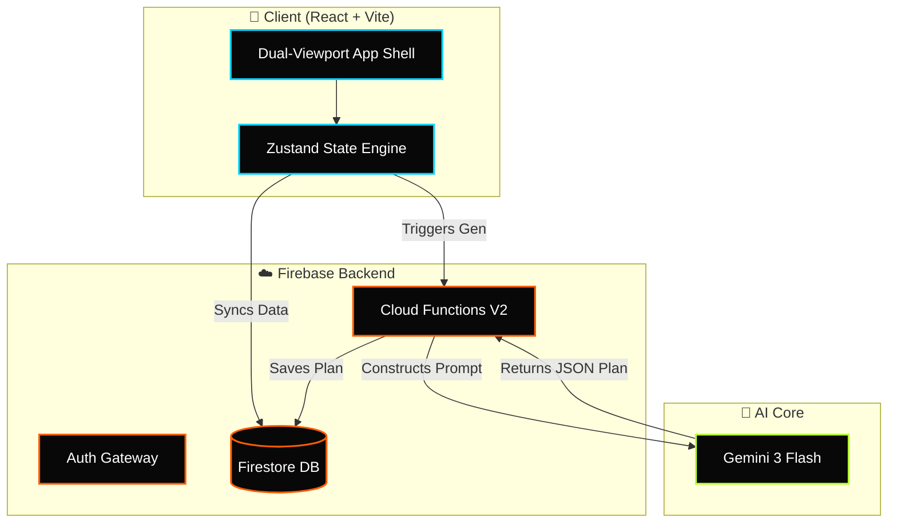
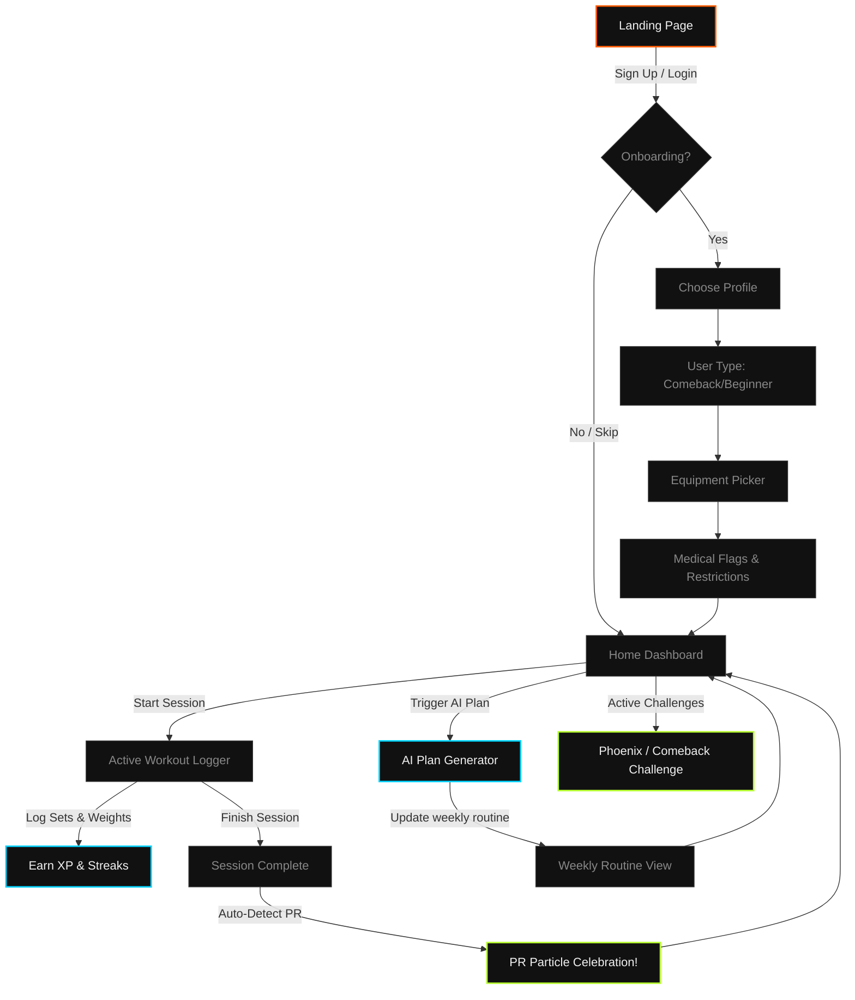

<div align="center">
  <!-- 🔥 Animated Typing Headline 🔥 -->
  <a href="https://github.com/PriyanshuG27/Fitdesi">
    
  </a>

  <!-- Animated Neubrutalism App Mockup Banner (Cache-Busted Relative Path) -->
  

  <br /><br />

  <!-- Animated Glowing Gemini Badge -->
  
  
  <h3>⚡ Premium Dark Athletic Gym Tracker & Recovery Platform ⚡</h3>
  
  <p>
    FitDesi is a dark athletic fitness tracking web app designed to solve the core failure modes of Indian gym culture: inconsistent attendance, lack of tracking, and difficult comeback phases after breaks.
  </p>

  <!-- 🛡️ Cool Tech Badges -->
  <p>
    
    
    
    
    
    
  </p>

  <br />

  <!-- Real-time Status Bento Grid -->
  <table align="center" style="border-collapse: collapse; border: 2px solid #333; background: #080808; font-family: 'Courier New', Courier, monospace; width: 100%; border-radius: 8px; overflow: hidden;">
    <tr style="border-bottom: 1px solid #333;">
      <td style="padding: 15px; border-right: 1px solid #333;"><strong>⚡ SYSTEM STATUS</strong></td>
      <td style="padding: 15px; color: #B5FF2D; border-right: 1px solid #333; text-shadow: 0 0 5px #B5FF2D;">🟢 PRODUCTION ACTIVE</td>
      <td style="padding: 15px; border-right: 1px solid #333;"><strong>🤖 AI ENGINE</strong></td>
      <td style="padding: 15px; color: #00D4FF; text-shadow: 0 0 5px #00D4FF;">⚡ GEMINI 3 FLASH</td>
    </tr>
    <tr>
      <td style="padding: 15px; border-right: 1px solid #333;"><strong>💾 DATABASE</strong></td>
      <td style="padding: 15px; color: #FF5C00; border-right: 1px solid #333; text-shadow: 0 0 5px #FF5C00;">🔥 FIRESTORE</td>
      <td style="padding: 15px; border-right: 1px solid #333;"><strong>🔒 AUTH GATEWAY</strong></td>
      <td style="padding: 15px; color: #F0F0F0; text-shadow: 0 0 5px #FFF;">🛡️ FIREBASE SECURE</td>
    </tr>
  </table>

</div>

---

## 🎨 The Design System (Neubrutalism & OLED)

FitDesi uses a custom **Neubrutalism + Dark OLED** style designed to look premium, energetic, and highly tactile. Interactive elements look *liftable*, matching the physical gym environment.

```
━━━━━━━━━━━━━━━━━━━━━━━━━━━━━━━━━━━━━━━━━━━━━━━━━━━━━━━━━━━━━━━━━━━━━━━━
🎨 PATTERN:     Mobile Bottom Navigation + Full-Screen Context Logging
                Desktop Left Sidebar + Multi-column Bento Grid
💻 THEME:       True OLED Black base (#080808) + High-contrast Borders
💥 ACCENTS:     Burnt Orange (#FF5C00) · Electric Cyan (#00D4FF) · Acid Lime (#B5FF2D)
⚡ TRANSITIONS: Framer Motion spring physics on actions & celebrations
━━━━━━━━━━━━━━━━━━━━━━━━━━━━━━━━━━━━━━━━━━━━━━━━━━━━━━━━━━━━━━━━━━━━━━━━
```

<details>
<summary><b>🎨 View Color Token Registry (CSS Variables)</b></summary>

```css
:root {
  /* Backgrounds */
  --bg-base:       #080808;   /* True OLED black */
  --bg-surface:    #111111;   /* Cards, panels */
  --bg-elevated:   #1A1A1A;   /* Modals, dropdowns */
  --bg-input:      #141414;   /* Input fields */

  /* Brand Accents */
  --primary:       #FF5C00;   /* Burnt orange — energy & drive */
  --primary-glow:  rgba(255, 92, 0, 0.25);
  --secondary:     #00D4FF;   /* Electric cyan — stats & tracking */
  --secondary-glow:rgba(0, 212, 255, 0.20);
  --accent-xp:     #B5FF2D;   /* Acid lime — level-up, PRs, milestones */
  --accent-xp-glow:rgba(181, 255, 45, 0.20);

  /* Typography Scale */
  --font-display:  'Barlow Condensed', sans-serif; /* Headings */
  --font-body:     'Outfit', sans-serif;           /* Main UI & reading */
  --font-mono:     'DM Mono', monospace;           /* Numeric stats */
}
```
</details>

---

## 🚀 Key Features

Click to expand and explore the technical implementation of FitDesi's features:

<details>
<summary><b>📱 Dual-Viewport App Layout (Mobile-Native vs. Bento Grid)</b></summary>
<blockquote>
FitDesi mounts completely different component trees based on screen width detection. Mobile screens (width &lt; 768px) load a bottom navigation bar and full-screen workout logger optimized for one-handed thumb reach. Desktop screens load a persistent sidebar with a dense bento-box dashboard of charts, tables, and recent activity logs.
</blockquote>
</details>

<details>
<summary><b>⚡ Fast Gym Logger &amp; PR Engine</b></summary>
<blockquote>
Designed to be faster than standard notes apps, requiring less than 10 total taps to complete a workout. Reps and weights use large, tactile increment/decrement buttons. When a PR is broken, the app detects it instantly and triggers a full-screen canvas particle celebration.
</blockquote>
</details>

<details>
<summary><b>🧠 Gemini AI Workout Planner</b></summary>
<blockquote>
Every week, a serverless Cloud Function triggers `gemini-3-flash` to construct a new 6-day training routine. The prompt feeds the model with the user's available equipment, medical limitations, session mood tags, fatigue logs, and training history, forcing it to outputs structured, type-safe JSON.
</blockquote>
</details>

<details>
<summary><b>🔥 Phoenix & Streak Challenges</b></summary>
<blockquote>
To solve the "post-break" failure loop where returning lifters overtrain and quit, the Phoenix Comeback Challenge scales down previous weights to 40-70% capacity, ramping up over 6-12 weeks with a 2x XP bonus multiplier.
</blockquote>
</details>

---

## 📐 System Architecture

This flowchart maps the relationships between the client, state stores, and Firebase services:



---

## 🧭 Application Flow & User Journey

Here is the step-by-step navigation path of a user from onboarding configuration to tracking exercises and generating routines:



---

## 🎮 Gamification & Level Tiers

XP earned through workouts unlocks different athlete ranks. The progression is configured as follows:

| Tier | Level Range | Required XP | Description / Perks |
| :--- | :--- | :--- | :--- |
| **Rookie** 🟢 | 1 – 5 | 0 – 999 XP | Entry-level rank, basic onboarding badges unlocked |
| **Challenger** 🔵 | 6 – 15 | 1,000 – 4,999 XP | Unlocks Custom Challenge builder and streak-at-risk warning notifications |
| **Athlete** 🟡 | 16 – 30 | 5,000 – 14,999 XP | Unlocks detailed progress range filters (90-day & 180-day charts) |
| **Elite** 🔴 | 31+ | 15,000+ XP | Unlocks global leaderboards and Streak Shield power-ups |

---

## 📂 Project Structure

<details>
<summary><b>📂 View Complete Directory Map</b></summary>

```
Fitdesi/
├── .env.example              # Template for frontend environment variables
├── .gitignore                # Production ignore patterns for keys & node_modules
├── eslint.config.js          # Code linting settings
├── index.html                # App entry document
├── package.json              # Client packages and scripts
├── postcss.config.js         # PostCSS plugins
├── tailwind.config.js        # Neubrutalism theme & typography customisations
├── vite.config.js            # Vite configurations and port setup
│
├── docs/                     # Full system documentation
│   ├── APP_FLOW.md           # Visual user flows and state diagrams
│   ├── AUDIT_CHECKLIST.md    # Pre-launch security & quality checklist
│   ├── BACKEND_SCHEMA.md     # Firestore collection structures & schemas
│   ├── DEPLOYMENT.md         # Detailed environment deployment procedures
│   ├── ENV_CONFIG.md         # Environment variable documentation
│   ├── ERROR_HANDLING.md     # Client & function error policies
│   ├── IMPLEMENTATION_PLAN.md# Technical breakdown of features
│   ├── PERFORMANCE.md        # Loading, interaction, and rendering targets
│   ├── PRD.md                # Product Requirements Document
│   ├── SECURITY.md           # Firestore rules and client token rotation
│   ├── TESTING.md            # Comprehensive client/backend testing manual
│   ├── TRD.md                # Technical Requirements Document
│   └── UI_UX_BRIEF.md        # CSS color tokens, layouts, & animations brief
│
├── functions/                # Firebase Cloud Functions (Backend)
│   ├── .env.example          # Template for backend Cloud Functions keys
│   ├── index.js              # Entrypoint for Cloud Functions export
│   ├── package.json          # Node.js 20 functions dependencies
│   └── src/
│       └── generatePlan.js   # Gemini 3 Flash workout prompt generator
│
└── src/                      # Client Application (Frontend)
    ├── App.jsx               # Layout toggle entrypoint
    ├── index.css             # Main stylesheet (Neubrutalism styles + Google Fonts)
    ├── main.jsx              # App mount point & env validation execution
    │
    ├── assets/               # Image/SVG asset files
    ├── components/           # Dual Viewport UI Components
    │   ├── desktop/          # Sidebar navigation, Bento dashboard, Dense graphs
    │   ├── mobile/           # Bottom navigation, fullscreen logger, Swipe panels
    │   └── shared/           # Protected routing and general layout wrappers
    │
    ├── data/                 # Curated exercise dataset & static mappings
    ├── hooks/                # Layout-agnostic Custom React Hooks
    │   ├── useAuth.js        # Auth state observer
    │   ├── useWorkout.js     # Active session, logging actions
    │   ├── useXPEngine.js    # Level tier and streak calculation
    │   ├── usePlan.js        # Custom plan generation handler
    │   └── ...
    │
    ├── lib/                  # Library SDK initializers
    │   ├── firebase.js       # Firebase Client SDK initializer
    │   └── firebaseConfig.js # Firebase config variables
    │
    └── stores/               # Zustand Global State Stores
        ├── useAuthStore.js
        ├── usePlanStore.js
        ├── useWorkoutStore.js
        └── ...
```
</details>

---

## ⚙️ Environment Configuration

<details>
<summary><b>🔑 View Local & Production Configuration Keys</b></summary>

### Client Environment Variables (`.env`)
Create a `.env` file in the project root:
```bash
VITE_FIREBASE_API_KEY=your_api_key
VITE_FIREBASE_AUTH_DOMAIN=fitdesi-app.firebaseapp.com
VITE_FIREBASE_PROJECT_ID=fitdesi-app
VITE_FIREBASE_STORAGE_BUCKET=fitdesi-app.appspot.com
VITE_FIREBASE_MESSAGING_SENDER_ID=your_messaging_sender_id
VITE_FIREBASE_APP_ID=your_app_id
```

### Backend Environment Variables (`functions/.env`)
Create a `.env` file in the `/functions` folder for local emulator testing:
```bash
GEMINI_API_KEY=your_gemini_api_key
```

For production, configure the key in the Firebase Cloud Function environment:
```bash
firebase functions:config:set gemini.key="YOUR_GEMINI_API_KEY"
```
</details>

---

## 🛠️ Local Development Setup

Follow these steps to run the FitDesi application locally:

### 1. Installation
Install the project dependencies for the client and backend functions:
```bash
# Clone the repository
git clone https://github.com/PriyanshuG27/Fitdesi.git
cd Fitdesi

# Install client packages
npm install

# Install functions packages
cd functions
npm install
cd ..
```

### 2. Set Up Firebase Emulators
The project is configured to work with Firestore and Firebase Auth Emulators:
```bash
# Install Firebase Tools if not already installed globally
npm install -g firebase-tools

# Login to Firebase
firebase login

# Initialize project references
firebase use --add

# Run the emulators
firebase emulators:start
```

### 3. Run the Frontend Development Server
In a new terminal window, start the local Vite development server:
```bash
npm run dev
```
Open `http://localhost:5173` to view the app in your browser.

---

## 🚀 Deployment

<details>
<summary><b>📦 View Deployment Steps (Vercel & Firebase)</b></summary>

### Deploying the Backend (Firebase Functions & Security Rules)
```bash
# Deploy firestore rules, indexes, and cloud functions
firebase deploy
```

### Deploying the Frontend (Vercel)
Install Vercel CLI and trigger a production deploy:
```bash
npm install -g vercel
vercel --prod
```
Ensure you have configured all client environment variables in the Vercel project dashboard under **Settings > Environment Variables**.
</details>

---

## 📖 Deep-Dive Reference Docs

For detailed reviews of technical requirements, audits, and performance targets:
* 📄 [Product Requirements Document (PRD)](./docs/PRD.md)
* 📄 [Technical Requirements Document (TRD)](./docs/TRD.md)
* 📄 [UI/UX Design Specification Brief](./docs/UI_UX_BRIEF.md)
* 📄 [Environment Configuration Guide](./docs/ENV_CONFIG.md)
* 📄 [Firestore Security & Rules Spec](./docs/SECURITY.md)
* 📄 [Performance & Load Optimization Plans](./docs/PERFORMANCE.md)
* 📄 [System Testing & Audit Framework](./docs/TESTING.md)
