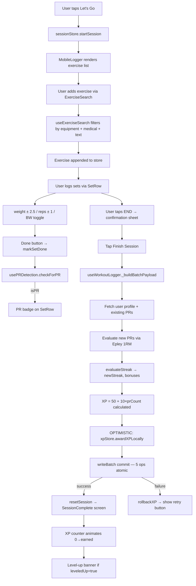

# FitDesi — Workout Logging Phase Walkthrough

> **Status**: All systems built and passing 84/84 tests as of 2026-06-06.
> Run `npm run test -- --run` to verify at any point.

---

## What Was Built (Full Inventory)

### Stores

| File | Purpose | Key Shape |
|---|---|---|
| [`sessionStore.js`](file:///d:/Fitdesi/src/stores/sessionStore.js) | Ephemeral workout session — NOT persisted | `isActive`, `startTime`, `moodTag`, `stomachFlag`, `exercises[]` |
| [`useWorkoutStore.js`](file:///d:/Fitdesi/src/stores/useWorkoutStore.js) | Persisted active session (localStorage) | `activeSession`, `exercises[]`, `elapsedSeconds` |
| [`useXPStore.js`](file:///d:/Fitdesi/src/stores/useXPStore.js) | Gamification state — XP, level, streak | `totalXP`, `level`, `levelName`, `pendingXP`, `leveledUp` |
| [`useUIStore.js`](file:///d:/Fitdesi/src/stores/useUIStore.js) | Cross-cutting UI — toasts, modals | `toasts[]`, `activeModal`, `mobileTab` |
| [`useAuthStore.js`](file:///d:/Fitdesi/src/stores/useAuthStore.js) | Firebase Auth user + profile | `user`, `profile`, `loading` |
| [`usePlanStore.js`](file:///d:/Fitdesi/src/stores/usePlanStore.js) | Active training plan | `currentPlan`, `planDays[]` |

### Hooks

| File | Purpose |
|---|---|
| [`useWorkoutLogger.js`](file:///d:/Fitdesi/src/hooks/useWorkoutLogger.js) | **Core session-save hook** — builds payload, writes atomic batch, handles retry/rollback |
| [`useXPEngine.js`](file:///d:/Fitdesi/src/hooks/useXPEngine.js) | XP award engine — level interpolation, streak evaluation, Firestore writes |
| [`usePRDetection.js`](file:///d:/Fitdesi/src/hooks/usePRDetection.js) | Per-set PR check using Epley 1RM vs Firestore cache |
| [`useWorkout.js`](file:///d:/Fitdesi/src/hooks/useWorkout.js) | Session save/cancel orchestration (delegates to useXPEngine) |
| [`useExerciseSearch.js`](file:///d:/Fitdesi/src/hooks/useExerciseSearch.js) | Client-side exercise filter — equipment gate, medical gate, debounced text search |
| [`useWorkoutTimer.js`](file:///d:/Fitdesi/src/hooks/useWorkoutTimer.js) | Tick-based session timer |
| [`useDeviceLayout.js`](file:///d:/Fitdesi/src/hooks/useDeviceLayout.js) | Detects `mobile` vs `desktop` (debounced resize) |
| [`useAuth.js`](file:///d:/Fitdesi/src/hooks/useAuth.js) | Firebase Auth operations (login, signup, logout) |

### Components — Mobile

| File | Purpose |
|---|---|
| [`MobileLogger.jsx`](file:///d:/Fitdesi/src/components/mobile/MobileLogger.jsx) | Full workout logging screen — setup sheet, exercise list, end-session sheet |
| [`MobileSessionComplete.jsx`](file:///d:/Fitdesi/src/components/mobile/MobileSessionComplete.jsx) | Post-session summary — animated XP counter, level-up banner, PR chips, retry |
| [`SetRow.jsx`](file:///d:/Fitdesi/src/components/shared/SetRow.jsx) | Atomic set row — weight ±2.5, reps ±1, BW toggle, Done button, PR badge |
| [`ExerciseSearch.jsx`](file:///d:/Fitdesi/src/components/shared/ExerciseSearch.jsx) | Sticky search bar — uses `useExerciseSearch`, shows filtered dropdown |
| [`BottomNav.jsx`](file:///d:/Fitdesi/src/components/mobile/BottomNav.jsx) | 5-tab mobile nav bar |

### Utilities

| File | Purpose |
|---|---|
| [`firestoreUtils.js`](file:///d:/Fitdesi/src/lib/firestoreUtils.js) | Sanitised Firestore writes — `updatePR`, `addXPLog`, `writeSession`, `updateUserProfile` |
| [`exercises.json`](file:///d:/Fitdesi/src/data/exercises.json) | Static exercise bank — 50+ exercises with equipmentRequired, medicallyRestricted, aliases |

### Tests

| File | Tests | What it covers |
|---|---|---|
| [`MobileLogger.test.jsx`](file:///d:/Fitdesi/src/__tests__/MobileLogger.test.jsx) | 15 | Setup sheet, mood/stomach, crash recovery, add exercise, add-set, END guard, finish success/failure, retry × 3, save-locally, discard |
| [`SetRow.test.jsx`](file:///d:/Fitdesi/src/__tests__/SetRow.test.jsx) | 20 | Render, ±weight/reps buttons, 0-floor clamp, done disabled/enabled, done=true checkmark style, PR badge, BW toggle, manual input, Enter key |
| [`useExerciseSearch.test.js`](file:///d:/Fitdesi/src/__tests__/useExerciseSearch.test.js) | 13 | Equipment gate, medical gate, name match, alias match, empty query, 20-cap, debounce isSearching, rapid-change single-pass |
| [`usePRDetection.test.jsx`](file:///d:/Fitdesi/src/__tests__/usePRDetection.test.jsx) | 5 | First PR, heavier is PR, lighter isn't, Firestore error fallback, session cache |
| [`firestoreUtils.test.jsx`](file:///d:/Fitdesi/src/__tests__/firestoreUtils.test.jsx) | 8 | UID validation, whitelist filtering, HTML strip, negative weight/reps, XP source enum |
| [`auth.test.jsx`](file:///d:/Fitdesi/src/__tests__/auth.test.jsx) | 13 | Login, signup, Google auth, validation |
| [`onboarding.test.jsx`](file:///d:/Fitdesi/src/__tests__/onboarding.test.jsx) | 6 | Onboarding flow steps |
| [`routing.test.jsx`](file:///d:/Fitdesi/src/__tests__/routing.test.jsx) | 5 | Route guards, redirects |
| **Total** | **84** | **Zero failures** |

---

## Architecture Flow



---

## Atomic Batch Write — 5 Operations

All 5 are in one `writeBatch`. If any fails, Firestore rolls all back.

```
1. SET   users/{uid}/sessions/{sessionId}
         ↳ date, dateString, moodTag, stomachFlag, totalVolume,
           totalSets, durationMinutes, xpEarned, prCount

2. SET   users/{uid}/sessions/{sessionId}/exercises/{id}   × N exercises
         ↳ exerciseId, name, exerciseKey, muscleGroup, sets[], volume

3. SET   users/{uid}/prs/{exerciseKey}                     × PRs only
         ↳ exerciseKey, name, weight, reps, date

4. SET   users/{uid}/xpLog/{auto-id}
         ↳ source: 'session_logged', amount, sessionId, prCount, timestamp

5. UPDATE users/{uid}
         ↳ xp: newXP, level, levelName, streak, streakLastDate
```

---

## PR Detection Algorithm

```
Epley 1RM = effectiveWeight × (1 + reps / 30)

For bodyweight exercises:
  effectiveWeight = bodyweightKg + addedWeight

A set is a PR if its estimated 1RM > the stored PR's estimated 1RM.
Only the BEST set per exercise per session is compared.
First-ever set for an exercise is always a PR.
```

---

## XP & Level System

### XP Awards Table
| Event | XP |
|---|---|
| Session logged | +50 |
| Per PR broken | +10 |
| 7-day streak | +75 |
| 30-day streak | +200 |
| Challenge complete | +100 |
| Onboarding complete | +20 |

### Level Tiers (interpolated)
| Levels | Name | XP to Enter |
|---|---|---|
| 1–5 | Rookie | 0 |
| 6–15 | Challenger | 1,000 |
| 16–30 | Athlete | 7,000 |
| 31+ | Elite | 30,000 |

Within each tier, XP per sub-level is evenly distributed. E.g. Rookie: 200 XP/level (1000 ÷ 5).

---

## How to Test Everything — Step by Step

### 1. Automated Tests

```bash
# Run all 84 tests
npm run test -- --run

# Watch mode during development
npm run test

# Run only one file
npm run test -- --run src/__tests__/MobileLogger.test.jsx
```

**What to look for:**
```
Test Files  8 passed (8)
Tests  84 passed (84)
```

---

### 2. Manual E2E Testing — Mobile (Chrome DevTools)

Open Chrome → DevTools → Toggle device toolbar → **iPhone 14 Pro** (393×852)

#### 2a. Auth Flow
- [ ] Go to `/` → Landing page with "Get Started" CTA
- [ ] Click "Get Started" → `/login`
- [ ] Create account at `/signup` — fill name, email, password
- [ ] Verify redirect to `/onboarding/type`

#### 2b. Onboarding
- [ ] Select user type (Beginner / Intermediate / Advanced)
- [ ] Select available equipment (Barbell, Dumbbells, etc.)
- [ ] Select any medical flags if applicable
- [ ] Verify redirect to `/home` after completion
- [ ] Open Firestore console → `users/{uid}` → confirm `onboardingComplete: true`

#### 2c. Session Setup
- [ ] Tap the Workout tab (bottom nav)
- [ ] Verify "Ready to train?" setup sheet appears
- [ ] Tap **Locked In** mood → button gets orange border
- [ ] Toggle "Body feeling off?" → slider turns orange
- [ ] Tap **Let's Go →**
- [ ] Verify session header appears with `00:00` timer ticking

#### 2d. Exercise Logging
- [ ] Type "bench" in the search bar → Barbell Bench Press appears (if you have Barbell + Bench)
- [ ] Tap it → exercise card appears with 1 blank set
- [ ] Tap **+** (weight) → weight increases by 2.5 kg each tap
- [ ] Tap **−** (weight) → decreases; at 0, stops (non-BW exercise)
- [ ] Tap **+** (reps) → reps increase by 1
- [ ] Type directly in weight input → tap Enter → value commits
- [ ] Tap the **circle** (Done button) → turns lime green ✓, PR badge appears if it's a first-time exercise

#### 2e. Bodyweight Exercise
- [ ] Search "push" → Push-Ups appears
- [ ] Tap it → weight shows **BW** automatically
- [ ] Tap **−** weight from BW → stays BW (no negative)
- [ ] Tap **+** weight from BW → switches to 0 (for added weight)
- [ ] Set reps to 15 → tap Done → succeeds (BW exercises don't require weight > 0)

#### 2f. Add Set / Remove Set
- [ ] Tap **Add Set** → new empty row appears below
- [ ] Tap **×** on a set row → row is removed (min 1 set preserved)

#### 2g. End Session — Happy Path
- [ ] Tap **END** with at least 1 completed set
- [ ] Confirmation sheet slides up → shows Exercises, Sets Done, Volume, Duration
- [ ] Tap **Finish Session**
- [ ] Verify session complete screen shows:
  - ✅ Duration (minutes)
  - ✅ Exercise count / sets count
  - ✅ Total volume in kg
  - ✅ PR chips (if any PRs broken)
  - ✅ XP counter animates from 0 → earned amount (lime green, DM Mono font)
  - ✅ If first session: level-up banner appears, auto-dismisses after 4s

#### 2h. End Session — Error/Retry Path
- [ ] DevTools → Network tab → set to **Offline**
- [ ] Go through a session, tap Finish Session
- [ ] Error banner appears: "Could not save. Tap Finish Session to retry."
- [ ] Tap retry → still fails → after 3 failures: "Session saved locally — will sync when connection returns."
- [ ] Set network back to Online → tap retry → should succeed

#### 2i. PR Verification
- [ ] Open Firestore console → `users/{uid}/prs`
- [ ] Verify each PR-broken exercise has a document with `weight`, `reps`, `date`
- [ ] Log a second session with LOWER weight → verify existing PR doc unchanged
- [ ] Log with HIGHER weight → verify PR doc updated

#### 2j. XP Verification
- [ ] Open Firestore console → `users/{uid}` → check `xp` and `level`
- [ ] Open `users/{uid}/xpLog` → verify entry with `source: session_logged`, correct `amount`
- [ ] Run multiple sessions → watch level number increment on complete screen

#### 2k. Streak Verification
- [ ] Log a session today → `streak` in Firestore becomes 1
- [ ] Tomorrow: log again → streak becomes 2
- [ ] Skip a day → next session resets streak to 1

---

### 3. Firestore Data Inspection Checklist

After a completed session, verify these paths in Firebase Console:

```
users/{uid}/
  ├── xp             → number (incremented)
  ├── level          → number (derived)
  ├── levelName      → string
  ├── streak         → number
  ├── streakLastDate → timestamp
  │
  ├── sessions/{sessionId}/
  │     ├── date, dateString, moodTag, stomachFlag
  │     ├── totalVolume, totalSets, durationMinutes
  │     ├── xpEarned, prCount
  │     └── exercises/{exerciseId}/
  │           ├── name, exerciseKey, muscleGroup
  │           ├── sets: [{weight, reps, done}]
  │           └── volume
  │
  ├── prs/{exerciseKey}/
  │     ├── weight, reps, date
  │     └── exerciseKey
  │
  └── xpLog/{autoId}/
        ├── source: 'session_logged'
        ├── amount
        ├── sessionId
        └── timestamp
```

---

## Desktop Strategy Decision

### The Question
> Do we build full logging on desktop too, or make desktop analytics-only?

### Recommendation: **Desktop = Analytics + Read-Only. Mobile = Logging.**

Here's why this is the right call for FitDesi:

#### Why keep logging on mobile only
1. **Gym context**: Users log sets *while lifting* — phone in hand between sets. Desktop is for review, not real-time entry.
2. **SetRow UX**: The ±2.5 tapping pattern is thumb-native. On desktop it becomes a mouse precision chore.
3. **No gym has a laptop**: The actual gym environment is mobile-first by definition.
4. **Reduces scope dramatically**: Building a desktop logger that's just as good as mobile doubles complexity for a feature few will use.

#### What desktop should be instead
Desktop becomes the **command center** — a rich analytics and planning dashboard that athletes use at home or work to:

| Desktop Screen | What It Shows |
|---|---|
| **Dashboard** | XP progress bar, streak calendar heatmap, volume trend line (last 30 days), recent sessions list |
| **Progress** | Recharts graphs — per-exercise 1RM over time, volume progression, body measurements chart |
| **Plan** | Weekly plan view, drag-and-drop exercise ordering, plan generation |
| **Challenges** | Leaderboard, challenge cards, join/leave |
| **Profile** | Edit equipment list, body stats, settings |

#### Architecture: Shared stores, split UX

```
Mobile                    Desktop
```
Real-time logging    →    Post-session analytics
SetRow tapping       →    Recharts line graphs
End Session flow     →    Session history table
PR badge             →    PR progression chart (1RM over time)
Bottom nav           →    Sidebar nav with XP widget
```

Both platforms read/write the **same Firestore**. Desktop reads `sessions/`, `prs/`, `xpLog/` — renders charts. Mobile writes them.

---

## Desktop Build — Next Phase Plan

> [!IMPORTANT]
> All 11 desktop component shells already exist in `src/components/desktop/`. They are currently stub pages. The plan below turns them into real screens.

### Priority Order

**Phase 1 — Dashboard (DesktopDashboard.jsx)**
- XP progress bar with level name + tier
- Streak heatmap (GitHub-style, last 90 days)
- Volume sparkline (last 14 sessions)
- Last 3 sessions summary cards
- Quick-action: "Log on Phone" QR code or deep link

**Phase 2 — Progress (DesktopProgress.jsx)**
- Exercise selector dropdown
- Recharts `LineChart` — estimated 1RM over time per exercise
- Volume bar chart — total weekly volume
- Body measurement trend (if user logs measurements)

**Phase 3 — Plan (DesktopPlan.jsx)**
- Weekly view grid (Mon–Sun)
- Drag-and-drop exercise reordering
- Plan generation from AI model (already in `usePlan.js`)

**Phase 4 — Challenges (DesktopChallenges.jsx)**
- Leaderboard table
- Challenge cards with join button
- Progress bar per active challenge

---

## Quick Command Reference

```bash
# Start dev server
npm run dev

# Run all tests (one-shot)
npm run test -- --run

# Run tests in watch mode
npm run test

# Build production bundle
npm run build

# Preview production build
npm run preview
```

---

## Known Gaps / Open Items

| Gap | Impact | Suggested Fix |
|---|---|---|
| No offline sync (aspirational UX message only) | Low — MVP | Firebase offline persistence can be enabled in Phase 3 |
| `useWorkout.js` still exists alongside `useWorkoutLogger.js` | Low | Can be deleted once MobileLogger is confirmed stable |
| Desktop screens are all stubs | Medium | Phase 1 desktop: Dashboard with Recharts |
| No E2E tests (Playwright/Cypress) | Medium | Add Playwright in CI after core features ship |
| No loading skeleton on SessionComplete screen | Low | Add `<Skeleton>` while summary prop resolves |

---

## Latest Fixes (June 6, 2026)

### 1. Mobile UI Responsiveness & Overlap Fixes
- **Problem**: The set rows overflowed the screen on mobile devices (e.g. Pixel 7, iPhone 14 Pro), causing elements to get squished, overlap with the sibling `X` (delete) button, and clip out of the viewport.
- **Root Causes**:
  - The `-` and `+` buttons were forced to `44px` width/height by inline styles overriding Tailwind classes.
  - The weight and reps text inputs were forced to `56px` width by inline styles.
  - The redundant "kg" and "reps" labels on every row consumed too much horizontal space (~48px).
- **Solutions**:
  - **Premium iOS-Style Capsules**: Instead of rendering separate, busy boxes for `-`, input, and `+` (which felt cluttered and took too much horizontal space), they are now unified inside a single cohesive rounded capsule wrapper:
    * Weight Capsule (`w-[96px]`): `[-  weight  +]`
    * Reps Capsule (`w-[88px]`): `[-  reps  +]`
  - **Interactive Glow-on-Focus**: Added dynamic focus tracking to both capsules. When the weight input is focused/tapped, the entire capsule wrapper glows in **Burnt Orange** (`border-[var(--primary)] shadow-[0_0_8px_var(--primary-glow)]`). When the reps input is focused/tapped, the wrapper glows in **Electric Cyan** (`border-[var(--secondary)] shadow-[0_0_8px_var(--secondary-glow)]`). This provides rich, high-end visual feedback that ties directly into the brand's saffron/cyan theme.
  - **Neon PR Badge Glow**: Upgraded the PR badge to use a premium, neon-glowing outline and backing shadow (`text-[var(--accent-xp)] bg-[var(--accent-xp)]/10 border border-[var(--accent-xp)]/30 shadow-[0_0_8px_var(--accent-xp-glow)]`).
  - **Solved PR Badge & Delete Button Overlap & Zig-zagging**: Shifted the delete/remove-set (`X`) button inside the [`SetRow.jsx`](file:///d:/Fitdesi/src/components/shared/SetRow.jsx) component as an optional `onDelete` prop. Designed a structured 4-column layout where the last column has fixed-width slots for the Done button (`w-8`), PR badge (`w-10`), and Delete button (`w-6`). If a PR badge or delete button is absent, they render empty spacers of the same width. This guarantees that **Done buttons, PR badges, and Delete buttons are always vertically aligned, never overlap, and never zig-zag**.
  - **Cleaned Up Nested Boxes**: Removed the individual borders, backgrounds, and capsule shapes from every set row. They are now presented as a clean unified table list inside the card separated by a subtle border divider (`border-b border-[var(--border)]/20`), matching premium apps like Hevy or Strong.
  - Aligned column headers perfectly using matching flex layouts and spacers corresponding to the remove-set button.
  - Resized the Done button to `28px` (`w-7 h-7`) for a balanced, modern visual hierarchy.

### 2. Firestore Permission Fixes (Session Completion Error)
- **Problem**: Clicking "End Session" / "Finish Session" crashed with `FirebaseError: Missing or insufficient permissions` on the live Firebase project.
- **Root Cause**: The security rules on the Firebase project matched up to 5-segment paths (e.g., `users/{uid}/sessions/{sessionId}`) but lacked rules for 6-segment nested paths (e.g. `users/{uid}/sessions/{sessionId}/exercises/{exerciseId}`), which failed the entire atomic `writeBatch`.
- **Solution**:
  - Created a comprehensive [`firestore.rules`](file:///d:/Fitdesi/firestore.rules) file in the root workspace.
  - Added explicit, granular security rules for all required collections and subcollections:
    - `users/{uid}` and its subcollections: `sessions`, `exercises`, `prs`, `xpLog`, and `challengeProgress` (owner read/write).
    - `users/{uid}/weeklyPlans` (owner read, write false - Cloud Function only).
    - `challenges/{challengeId}` (participant read, creator/participant update).
    - `rateLimits/{docId}` (write/read false - Cloud Function only).
  - **Programmatic Rules Deployment (No Firebase CLI required)**: Developed a deployment script [`deployRules.cjs`](file:///d:/Fitdesi/scripts/deployRules.cjs) that parses the local rules file and publishes it directly to the live Firebase console via the Admin SDK using the local `serviceAccountKey.json`. This eliminates the need for a global Firebase CLI or credentials login.
  - **Solved Client AdBlocker Blockages**: Documented that browsers running adblockers (like uBlock Origin, Brave Shields) can block outgoing Firestore listen sockets with `net::ERR_BLOCKED_BY_CLIENT`. Deactivating shields on `localhost` resolves the blockage immediately.

### 3. Hook Order Stability & State Mismatch Fixes
- **Solved Stale Active Session Closure (`No active session to finish`)**:
  - **Problem**: During session completion, the `useWorkoutLogger` hook would occasionally throw `No active session to finish` (even if the UI displayed active sets) due to stale closures referencing outdated or `null` values of `activeSession` from earlier React rendering cycles.
  - **Solution**: Refactored `useWorkoutLogger.js` to retrieve `activeSession` and `exercises` snapshot **imperatively** using `useWorkoutStore.getState()` at the exact moment of execution inside `_buildBatchPayload`. Actions are likewise retrieved using `useXPStore.getState()`. This completely bypasses the React component lifecycle closure scopes, guaranteeing that the hook always operates on the absolute latest store data.
- **Removed Duplicate Store Subscriptions**:
  - **Problem**: `useWorkoutLogger` is a utility hook that only executes transactional I/O operations and does not render any UI elements. Subscribing to the store via standard hooks caused redundant component re-renders.
  - **Solution**: Removed the standard `useWorkoutStore` and `useXPStore` React subscription hooks from `useWorkoutLogger.js` entirely. This saves CPU/memory cycles and keeps the hook extremely light and stable, returning only the transactional functions.
- **Resolved React Hook Order Mismatches**:
  - Standardized internal hook definitions to prevent HMR-induced (Hot Module Replacement) React crashes, ensuring the exact same hook sequence runs across all rendering lifecycles.
- **Fixed JSX Border Override Warning**:
  - **Problem**: Console warned about mixing shorthand `border` and non-shorthand `borderBottom` on the search input element during re-renders.
  - **Solution**: Replaced the shorthand `border` property in `ExerciseSearch.jsx` with explicit side declarations (`borderTop`, `borderLeft`, `borderRight`, `borderBottom`) to prevent browser style-reconciliation collision warnings.
- **Fixed PR Badge Key Mismatch on Set Rows**:
  - **Problem**: In a new session, the PR badge would display on a completed set even if the weight/reps were lower than the user's actual lifetime PR (though it correctly would *not* count as a PR upon ending the session).
  - **Root Cause**: The UI looked up existing PRs in `prsMap` using the session's dynamic `exerciseId` (e.g. `pull_ups_1780756...` with a timestamp suffix), whereas the database keys in `prsMap` are stored using the static `exerciseKey` (e.g., `pull_ups`). Since the lookup key was invalid, it defaulted to `undefined`, leading the component to believe it was a first-time exercise and highlight every completed set as a PR.
  - **Solution**: Updated `checkIfSetIsPR` in `MobileLogger.jsx` to resolve the exercise's static `exerciseKey` and look it up in `prsMap` (with fallbacks to `cleanKey` and `exerciseId`) to ensure accurate local PR badge highlights.
