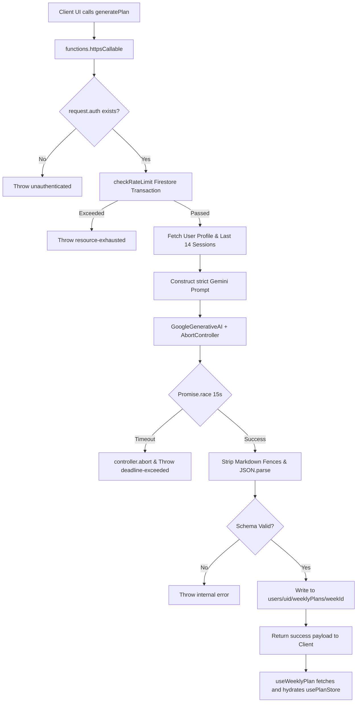

# FitDesi — Phase 3 Walkthrough: AI Generation & Progress Tracking

> **Status**: AI Plan Generation (Cloud Functions) and Progress Data Layer built and passing all unit tests (123 Frontend + 7 Backend) as of 2026-06-06.

---

## What Was Built (Full Inventory)

### Cloud Functions (`functions/`)

| File | Purpose | Security & Logic |
|---|---|---|
| [`generatePlan.js`](file:///d:/Fitdesi/functions/src/generatePlan.js) | Core Gemini AI orchestration | Passes `AbortController` signal for strict 15s timeout; strips markdown code fences; parses exact JSON schema. |
| [`rateLimiter.js`](file:///d:/Fitdesi/functions/src/rateLimiter.js) | Enforces quota limitations | Uses Firestore transactions to guarantee max 5 calls/hour per UID. |
| [`validators.js`](file:///d:/Fitdesi/functions/src/validators.js) | Input & Output validation | Validates raw JSON output from Gemini strictly against structural requirements (7 days, nested exercises). |
| [`index.js`](file:///d:/Fitdesi/functions/src/index.js) | Serverless Entrypoint | Lightweight facade exporting `generatePlan` via `onCall` (asia-south2). |

### Frontend Hooks (`src/hooks/`)

| File | Purpose | Key Behaviors |
|---|---|---|
| [`useWeeklyPlan.js`](file:///d:/Fitdesi/src/hooks/useWeeklyPlan.js) | Plan Fetching & Generation | Orchestrates Cloud Function trigger. Hydrates the global `usePlanStore.js` (no local state hoarding). |
| [`useProgress.js`](file:///d:/Fitdesi/src/hooks/useProgress.js) | Dashboard Data Layer | Exports `useStrengthData`, `useVolumeData`, and `usePRList` for the charts. Handles data aggregation safely with `AbortController` on unmount. |

### Test Suites

| File | Framework | Tests | What it covers |
|---|---|---|---|
| [`generatePlan.test.js`](file:///d:/Fitdesi/functions/src/__tests__/generatePlan.test.js) | Jest (Node) | 7 | Auth walls, rate limits, JSON parsing failure safety, schema validation bypasses, 15-second Promise race timeouts. Achieves >70% statement coverage. |
| [`progress.test.js`](file:///d:/Fitdesi/src/__tests__/progress.test.js) | Vitest | 6 | Ensures `useStrengthData` sorts oldest-first (Ascending), `useVolumeData` correctly fills gap weeks with `0` volume instead of `undefined`, unmount cleanup, and `usePRList` descending sort. |

---

## Architecture Flow

### 1. Plan Generation (Phantom Execution Mitigated)



### 2. Progress Data Aggregation

```mermaid
flowchart TD
    A[Dashboard UI Mounts] --> B[useVolumeData]
    B --> C[Query last 12 weeks of sessions]
    C --> D[Group by ISO Week YYYY-WNN]
    D --> E[Math: Fill gaps where volume = undefined -> 0]
    E --> F[Return array of { week, totalVolume }]
    
    A --> G[useStrengthData]
    G --> H[Query last 60 sessions]
    H --> I[Filter to specific exerciseKey]
    I --> J[Map to maxWeight per session]
    J --> K[Return array sorted oldest-first for LineChart]
```

---

## Data Aggregation Details

### `useVolumeData` (Gap Filling Algorithm)
When users take a break for a week, their sessions query will naturally skip that week. The `useVolumeData` hook explicitly reconstructs the week timeline mathematically using an `ISO 8601` offset algorithm. It iterates over the target window and defaults missing weeks to `0` volume, preventing charting libraries from drawing discontinuous or skewed lines.

### `useStrengthData` (In-Flight Abortion)
Since strength data fetches potentially dozens of sub-collections (`sessions/{id}/exercises`), the hook establishes a strict `AbortController` linked directly to the React `useEffect` unmount phase. If the user navigates away mid-fetch, the execution completely collapses instantly, preventing `React state update on unmounted component` memory leaks.

---

## How to Test Everything — Step by Step

### 1. Automated Tests (Backend)

We implemented an isolated Jest suite mapped explicitly to a Node environment for the Cloud Functions.

```bash
cd functions
npm test
```
**What to look for:**
- `7 passed` out of 7 tests in `generatePlan.test.js`.
- A coverage table output at the bottom indicating `generatePlan.js` statement coverage is >70%.

### 2. Automated Tests (Frontend Data Layer)

The data aggregation hooks are covered natively in the Vitest runner alongside the components.

```bash
npx vitest run src/__tests__/progress.test.js
```
**What to look for:**
- `6 passed` tests specifically testing the sorting configurations and default `0` gap fillers.

### 3. Manual E2E Testing (Firebase Emulator)

If you have your Firebase Emulators running, you can manually trigger and trace the `generatePlan` execution.

1. **Start Emulator:**
   ```bash
   firebase emulators:start
   ```
2. **Web UI Trigger:**
   - Log into the app locally.
   - Attach a button to `useWeeklyPlan().generatePlan()` or trigger it directly.
3. **Verify Execution Trace:**
   - Watch the emulator logs terminal.
   - It should hit `functions: generatePlan`.
   - Wait 3-5 seconds. You should see the successful log and a new document instantly populate inside `users/{uid}/weeklyPlans/{YYYY-WNN}` via the Firestore Emulator UI (`localhost:4000/firestore`).
4. **Trigger Timeout Fallback (The Phantom Mitigation):**
   - In `functions/src/generatePlan.js`, artificially change the `setTimeout` to `1` ms instead of `15000` ms.
   - Trigger the plan again in the UI.
   - It should fail almost instantly, throwing `deadline-exceeded`.
   - The UI toast should show: "Plan generation timed out. Please try again."
