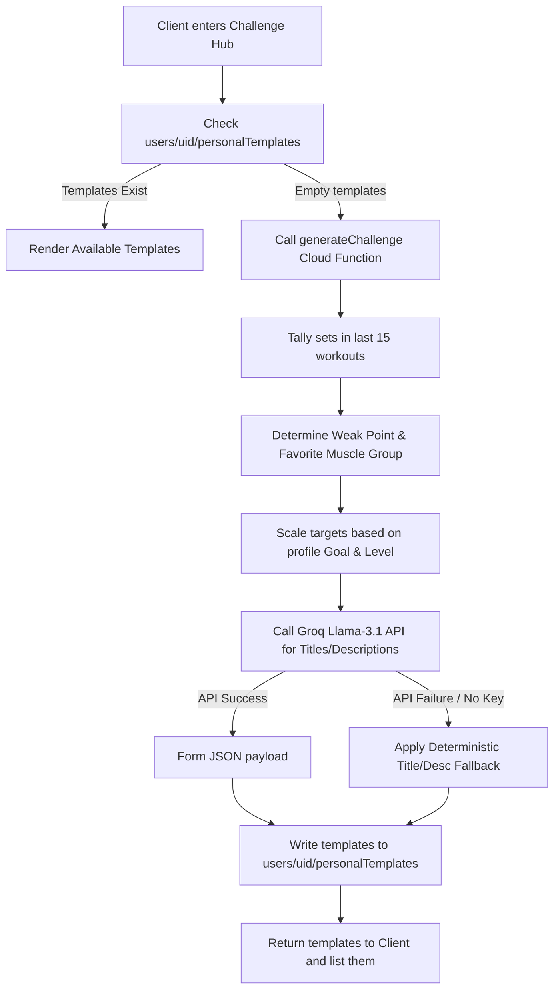
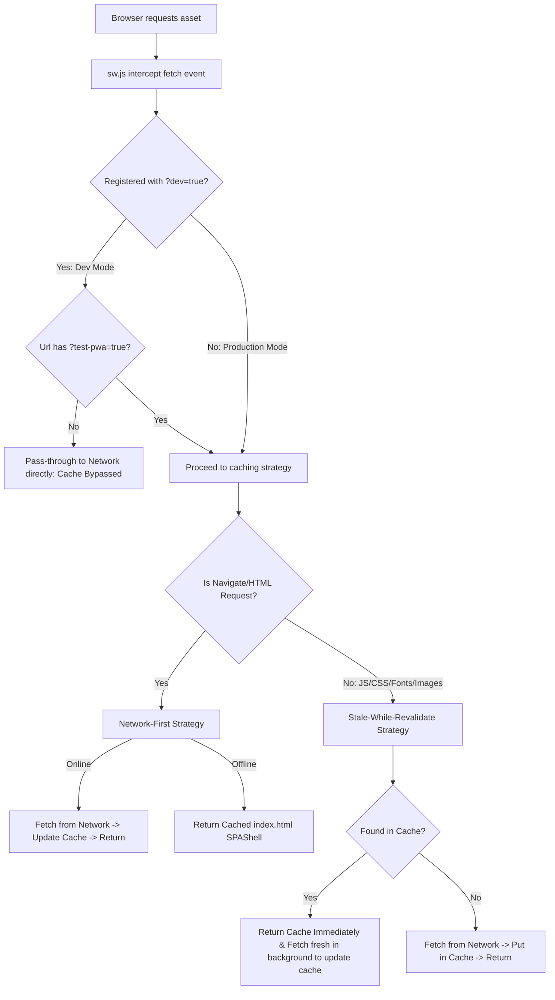

# FitDesi — Phase 5 Walkthrough: Weekly Recap & Gamified Retention Engine

> **Status**: **Phase Complete.** The Weekly Recap System, Personalized Challenge Engine, Wave 2 Gamification Mechanics (Flame Wagers, Overdrive Hour, Skill Tree, Boss Fights), and Production PWA Caching strategy have been successfully built, verified, and pass all 150 automated tests (Vitest + Jest).

---

## What Was Built (Full Inventory)

### Cloud Functions (`functions/`)

| File | Purpose | Security & Logic |
|---|---|---|
| [`generateChallenge.js`](file:///d:/Fitdesi/functions/src/generateChallenge.js) | Personalized AI Challenge Generator | Tallies muscle group volume from the last 15 workouts to find the user's Weak Point and Favorite Group; scales targets based on goals; queries Groq API (`llama-3.1-8b-instant`) for gamified title and description with deterministic fallbacks. |
| [`rateLimiter.js`](file:///d:/Fitdesi/functions/src/rateLimiter.js) | Quota Limiting | Configured rate limiter to `MAX_CALLS = 3` calls per hour per user. |

### Frontend Hooks & Stores (`src/hooks/` & `src/stores/`)

| File | Purpose | Key Behaviors |
|---|---|---|
| [`useWeeklyRecap.js`](file:///d:/Fitdesi/src/hooks/useWeeklyRecap.js) | Recap Data Collector | Aggregates volume, reps, PRs, and best lifts from Monday to Sunday. Detects completed sets using both `set.done` and `set.completed` flags. Fallbacks to bodyweight rep metrics if no external weight was logged. |
| [`useChallenges.js`](file:///d:/Fitdesi/src/hooks/useChallenges.js) | Challenges Hub Hook | Manages active/available slots; restricts Comeback templates to comeback users; handles 24h cooldown locks on abandonment; enforces duplicate active checks; implements optimistic UI deletion filters. |
| [`useWorkoutLogger.js`](file:///d:/Fitdesi/src/hooks/useWorkoutLogger.js) | Session Logger updates | Automatically triggers active challenge progress increments in the background; awards +200 XP for Boss Fights; rolls 10% chance for Flash Quests; applies Overdrive and Skill Tree multipliers. |
| [`useWorkoutStore.js`](file:///d:/Fitdesi/src/stores/useWorkoutStore.js) | Session Store updates | Exposes `isOverdrive` session flags and `setOverdrive` toggle. |

### UI Components (`src/components/`)

| File | Purpose | Visual & Interaction Design |
|---|---|---|
| [`WeeklyRecapScreen.jsx`](file:///d:/Fitdesi/src/components/mobile/WeeklyRecapScreen.jsx) | Weekly Recap overlay | Neubrutalist card displaying stats; offscreen `html2canvas` share card generator; Web Share API and download fallback; high z-index overlay (`z-[9999]`). |
| [`MobileChallenges.jsx`](file:///d:/Fitdesi/src/components/mobile/MobileChallenges.jsx) | Mobile Challenges Hub | Split Campaign/Quest slots; neon progress bars; pulsing locked cards with remaining cooldown timer; Overdrive Camera upload; Flame Wager panel; RPG Skill Tree unlocks; custom `CONQUEROR WARNING` abandon overlay. |
| [`MobileHome.jsx`](file:///d:/Fitdesi/src/components/mobile/MobileHome.jsx) | Home dashboard trigger | Triggers the Sunday Weekly Recap banner and handles seen dismissal states. |
| [`MobileProfile.jsx`](file:///d:/Fitdesi/src/components/mobile/MobileProfile.jsx) | Profile Settings trigger | Adds a permanent "Weekly Recap" button to re-watch the current week's summary at any time. |

---

## Core Systems & Architecture Flows

### 1. Personalized Challenge Generation Flow (Groq Hybrid Engine)

This system calculates strict mathematical targets locally or in Cloud Functions (to prevent AI hallucination of invalid fitness targets) and queries the Groq API solely for creative gamification text.



### 2. Service Worker Routing Flow (Production-Ready vs. Local Dev)

The PWA caching is split to bypass local caching during development so hot reloading works perfectly, while optimizing production caches with a Network-First strategy for documents.



---

## Gamified Retention Mechanics Detailed

### A. Long-TermConsistency Campaigns (8–12 Weeks)
* **Comeback Challenge (12 Weeks)**: Enforced via `profile.userType === 'Comeback'`. Targets 3 workouts/week. Graduates the user to `'Regular'` status and awards `+500 XP`, `+1 Streak Shield`, and `+1 XP Booster`.
* **Streak Challenge (8 Weeks)**: Core consistency driver. Awards `+500 XP` and `+1 XP Booster`.

### B. Medium-Term Goal-Aligned Campaigns (4 Weeks)
* Generated for **Weak Point** (lowest volume) and **Favorite Muscle Group** (highest volume) targets:
  - **Strength & Muscle Gain**: 18 sets (Weak Point) / 24 sets (Favorite).
  - **Fat Loss & General Fitness**: 12 sets (Weak Point) / 16 sets (Favorite).
* Awards `+500 XP` and `+1 Streak Shield` (for Weak Point).

### C. Short-Term Action Quests (2–7 Days)
* **Flame/XP Wagers**: Bet 50, 100, or 200 XP that you will complete 3 workouts in 7 days. Pays out `2x` on success, burns wager on failure.
* **Inactivity Re-ignition Quest**: Injected if inactive for $>4$ days. Complete 1 workout in 48 hours to claim `+100 XP`.
* **Flash Quests**: 10% surprise chance upon saving any workout. E.g., `Flash Quest: Stretch Out` (complete 5-min stretch in the next session for `+50 XP`).

### D. Overdrive Hour & RPG Skill Tree
* **Overdrive Hour**: Triggers within $\pm 2$ hours of peak historical workout time. Uploading a live camera snapshot of gym equipment verifies status and enables a `1.5x` XP session multiplier.
* **RPG Skill Tree**: Unlocks nodes using Level Skill Points:
  - *Iron Will*: Decreases streak decay.
  - *Adrenaline Rush*: PR XP increased to 12 XP.
  - *Recovery Protocol*: Boosts Flash Quest spawn rate to 20%.

---

## Verification & Testing Guide

### 1. Automated Test Suites
The automated tests check all features, including mock Firestore transactions, local storage seen flags, and timer cleanups.

```bash
# Run Vitest suite (Frontend)
npm test -- --run
```
**Expectation:**
- `15 passed` test files.
- `150 passed` test assertions with zero failures or hangs.

### 2. Manual Verification Checklist
1. **Weekly Recap Sunday Trigger**:
   - Change your system date or mock database logs to a Sunday.
   - Open the Home dashboard. The "Weekly Recap" card should slide up.
   - Click "View Summary" to open the high z-index overlay. Verify the "Best Lift" fallback loads (e.g. bodyweight reps) if no heavy weights were logged.
   - Click "Share Summary" on mobile to open native share sheet, or download on desktop.
   - Dismiss the modal. Reload the dashboard — the banner should remain hidden. Go to your Profile settings, and tap the "Weekly Recap" option to re-watch the recap.
2. **Challenge Deletion Cooldown**:
   - Navigate to `/challenges` on mobile.
   - Start any available template challenge. It will appear under active slots.
   - Tap "Remove" at the bottom of the card. The `CONQUEROR WARNING` Neubrutalist overlay will slide up.
   - Click "ABANDON". The card will optimistically disappear instantly.
   - Check your profile document in Firestore: a 24-hour timestamp lock is written under `cooldowns` for that subtype.
   - The template card in the available section will now display a pulsing red Lock icon and a disabled button countdown (e.g. `Locked for 24h remaining`).
